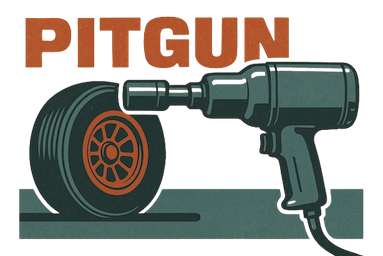

[](https://pitgun.loicbelec.com)

## What is Pitgun?
Pitgun is a modular Rust workspace for telemetry and high-frequency data processing.

## ⚠️ WARNING
 This repository is **under active development**. Interfaces may change.

## 🧱 Crates
- **pitgun-core**: core library with domain types, parsers, processors, and sinks
- **pitgun-cli**: command-line interface to ingest, transform, and export telemetry data (manifest-driven or flags)
- **pitgun-emulator**: UDP emitter that replays CSV datasets (multi-channel) with optional pacing

## ⚙️ Current features
- Emit UDP packets from CSV datasets (`Timestamp, ChannelValue`) at configurable pace (real-time or as fast as possible)
- Subscribe over UDP and route through a pipeline of processors/sinks
- Processors:
  - `channel_filter` (whitelist channels)
  - `scale` (multiply one channel by a factor)
  - `segment_aggregate` (window by segment key with mean/max/min/stddev/count/sum)
  - `stats` (print per-channel counts/gaps)
- Sinks:
  - Console JSON printer
  - Per-channel CSV recording (optional)
- Declarative YAML manifest to assemble the pipeline (see `manifests/dummy-pitgun.yaml`)
- Minimal binary frame format:
```
[len_channel:u16][channel][ts_csv:u128 LE][value:f64 LE]
```

## 🚀 Quickstart
1) Emit telemetry from CSV:
```bash
cargo run -p pitgun-emulator -- \
  --target 127.0.0.1:5001 \
  --input nEngine=datasets/telemetry/nEngine.csv \
  --input throttle=datasets/telemetry/rThrottle.csv \
  --pace
```

2) Subscribe with a manifest-driven pipeline:
```bash
cargo run -p pitgun-cli -- subscribe --config manifests/dummy-pitgun.yaml
```
`dummy-pitgun.yaml` includes a channel filter, a scale processor, and stats + console sink.

## 🧭 Backlog

- **Event reliability**  
  Sequence numbers, loss detection, and consistent semantics across sources.

- **Typed & shared wire format**  
  Unified serialization crate for sources, processors, and sinks.

- **Ecosystem expansion**  
  New sinks (Parquet, Kafka, Arrow), gRPC source, and manifest-driven pipelines.

- **Developer experience**  
  Bundle/Toolbox registry, improved CLI ergonomics, LLM-assisted manifest generation.

- **Performance & robustness**  
  Benchmarks, stress tests, memory profiling, and throughput optimisation.
