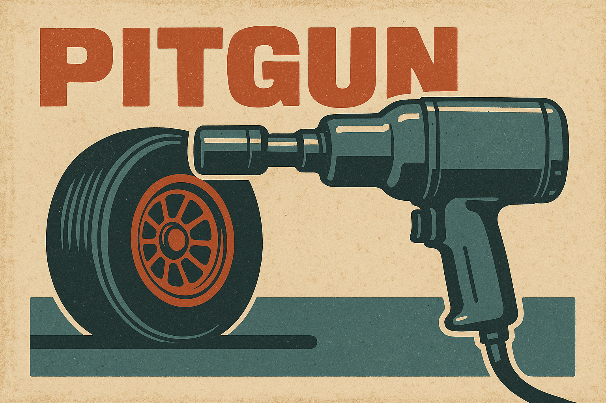

Pitgun is a modular Rust workspace for telemetry and high-frequency data processing.

## Crates
- **pitgun-core**: core library with domain types, parsers, and pipelines
- **pitgun-cli**: command-line interface to ingest, transform, and export telemetry data
- **pitgun-emulator**: UDP emitter that replays CSV datasets (e.g. telemetry channels) with optional pacing

## Current features
- Read simple CSV datasets (`Timestamp, Value`)
- Emit UDP packets at configurable pace (replay real-time or as fast as possible)
- Minimal binary frame format: `[len_channel:u16][channel][ts_csv:u128 LE][value:f64 LE]`

## Roadmap
- Add sequence numbers & loss detection
- Implement ingestion sinks (Parquet, Kafka, etc.)
- Shared wire format crate
- Benchmarks & performance tests

---

⚠️ This repository is **under active development**. Interfaces may change.