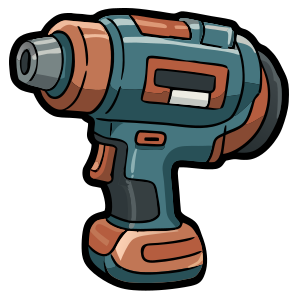

<p align="center">
  <a href="https://pitgun.com">
    
  </a>
</p>

<h1 align="center">Pitgun</h1>

<p align="center">
  <strong>Deterministic simulation to telemetry, in Rust.</strong>
</p>

<p align="center">
  Model · Simulate · Observe · Replay · Verify
</p>

<p align="center">
  <a href="https://github.com/loicbelec/pitgun/actions/workflows/pitgun-ci.yml"></a>
  <a href="LICENSE"></a>
  <br>
  
  <a href="https://github.com/loicbelec/pitgun/actions/workflows/pitgun-ci.yml"></a>
  <a href="https://github.com/loicbelec/pitgun/actions/workflows/pitgun-ci.yml"></a>
  
</p>

<p align="center">
  <a href="https://pitgun.com">Website</a> ·
  <a href="https://pitgun.dev">Developer blueprints</a> ·
  <a href="https://play.pitgun.com">Play Racing</a>
</p>

Pitgun is an experimental framework for building, running, observing, and
replaying deterministic time-series simulations. It connects versioned models
to reproducible execution, typed telemetry, and auditable replay.

Racing is Pitgun's first reference application and proving ground. The framework
is designed to become useful beyond motorsport wherever reproducible simulations,
event streams, and auditable results matter.

> [!IMPORTANT]
> Pitgun is an alpha-stage personal R&D project. Its deterministic contracts are
> being stabilized, but APIs and crate boundaries may still change.

## Run a Verified Simulation

Download a versioned binary from the
[GitHub Releases page](https://github.com/loicbelec/pitgun/releases),
extract it, enter its directory, then execute the complete local loop:

```bash
./pitgun --version
./pitgun demo racing --seed 42 --output ./pitgun-quickstart-run
```

The final line is the stable automation boundary:

```text
VERIFIED sha256:89dc458a7460056dd519f5cda74c55c2b2b47f7091f1309ae10d11a2eb46a64a
```

The [under-five-minute quickstart](docs/QUICKSTART.md) provides copy-paste
instructions for macOS, Linux, and workspace execution, including checksum
validation and a safe verification-failure exercise. No hosted Pitgun service,
account, or external database is required.

## The Simulation Loop

| Stage | Pitgun responsibility |
|---|---|
| **Model** | Define versioned domain inputs, contracts, registries, and physical parameters. |
| **Simulate** | Execute seeded logic consistently across native Rust and WebAssembly. |
| **Observe** | Emit typed events and telemetry through reusable ingestion and processing components. |
| **Replay and verify** | Preserve run identity and artifacts so results can be reproduced and compared. |

The long-term objective is not a universal physics engine. Pitgun provides the
deterministic execution and telemetry infrastructure; each application supplies
its own domain model and physical rules.

## What Exists Today

- A [deterministic run contract](docs/DETERMINISTIC_RUN_CONTRACT_V1.md) covering
  run identity, replay inputs, artifacts, and native/WASM comparison
- A versioned [stable RNG contract](docs/RNG_V1.md) with independently derived
  random streams
- A Racing golden scenario exercised in both native Rust and Node/WASM
- Published `run_id`, canonical Racing output, and telemetry summary digest vectors
- A versioned maximum-speed metric calculated from emitted typed telemetry
- Portable Run Bundle V1 replay and deterministic verification in a fresh process
- Racing physics, lap simulation, data packs, and browser-compatible WASM
- Domain-neutral telemetry envelopes, frames, manifests, and processing pipelines
- Replay and command-line tooling for operating local data flows
- Optional adapters for observed telemetry over UDP and WebSocket
- Policy, signing, gateway, and authority building blocks for hosted deployments

The Racing fixture now produces the same `run_id`, `output_digest`, and
`telemetry_summary_digest` in native Rust and Node/WASM. The checked-in canonical
artifacts are compared before their hashes so a regression identifies the first
changed result rather than only reporting a digest mismatch.

## Try the Deterministic Boundary

### Prerequisites

- A stable Rust toolchain
- Cargo
- Optional: Node.js and `wasm-pack` for the WASM check

Clone the repository and run the native Racing golden scenario:

```bash
git clone https://github.com/loicbelec/pitgun.git
cd pitgun
cargo test -p pitgun-solver --test racing_golden
```

Run the corresponding Node/WASM test:

```bash
cargo install wasm-pack --locked --version 0.14.0
wasm-pack test --node crates/pitgun-solver
```

For the entire Rust workspace:

```bash
cargo test --all
```

The CLI executes the versioned Racing scenario, collects typed telemetry, and
persists a validated deterministic run bundle locally:

```bash
cargo run -p pitgun-cli -- demo racing --seed 42
```

By default, the bundle is written below `./pitgun-runs/sha256-<run-id>/`. Use
`--output <PATH>` to select the exact destination. Repeating the same command
validates and reuses the immutable bundle rather than overwriting it.

It reports the observed maximum speed calculated by a domain-neutral telemetry
aggregator, reloads the committed bundle, replays its telemetry, and prints the
final `VERIFIED <run-id>` boundary. The standalone reader can verify the same
bundle in a fresh process:

```bash
cargo run -p pitgun-cli -- replay /path/to/run-bundle
```

The public behavior is specified in the
[Racing demo CLI contract](docs/RACING_DEMO_CLI_V1.md).
The portable files and their validation rules are documented in
[Deterministic Run Bundle V1](docs/RUN_BUNDLE_V1.md).

## Framework and Racing

| | Framework | Racing |
|---|---|---|
| **Role** | Reusable deterministic simulation, telemetry, replay, and governance infrastructure | Reference application and realistic telemetry generator |
| **Owns** | Execution contracts, envelopes, pipelines, manifests, run identity, verification primitives | Cars, circuits, setups, strategies, lap physics, and race orchestration |
| **Purpose** | Support multiple deterministic time-series domains | Prove the framework against a concrete, engaging domain |

Motorsport remains central as the showcase: it makes simulation results visible,
creates useful datasets, and continuously tests native/WASM portability. It is
not intended to define the framework's generic abstractions.

## Solver and Simulator

Pitgun deliberately preserves two different responsibilities:

| Component | Responsibility |
|---|---|
| **Solver** | Deterministic execution, stable randomness, run identity, hashing, and verification primitives |
| **Simulator** | Domain state, physical rules, time evolution, events, and application-specific outputs |

The repository is currently migrating toward this boundary. Some Racing golden
logic still lives in `pitgun-solver`; the target separation is documented in
[Framework Boundaries](docs/FRAMEWORK_BOUNDARIES.md). The README describes both
the current implementation and the intended direction rather than presenting the
migration as complete.

## Architecture at a Glance

The primary architecture follows the deterministic loop rather than a transport
stack:

| Role | Responsibility | Main components |
|---|---|---|
| **Core contract** | Define versioned scenarios, telemetry frames, run identity, and canonical evidence | `crates/pitgun-contract` |
| **Deterministic compute** | Execute and verify reproducible runs | `crates/pitgun-solver` |
| **Reference workload** | Model Racing physics, orchestrate races, and expose WASM | `crates/pitgun-simulator` |
| **Telemetry processing** | Transform generated channels with manifest-defined logic | `crates/pitgun-core` |
| **Replay and tooling** | Run, inspect, replay, and verify local artifacts | `apps/pitgun-cli`, `apps/pitgun-replay` |
| **Hosted governance** | Constrain, sign, receive, and audit distributed runs | `crates/pitgun-policy`, `crates/pitgun-signing`, `services/pitgun-authority`, `services/pitgun-gateway` |
| **Observed-data integrations** | Capture external telemetry for comparison, calibration, processing, or later replay | `pitgun-source-udp`, `pitgun-source-ws`, `pitgun-codec-*` |

```text
crates/     reusable framework and simulation crates
apps/       operator and developer tools
services/   deployable runtime services
docs/       contracts, architecture, and technical documentation
examples/   manifests, registries, and integration examples
policies/   policy samples
```

The complete crate and transport inventory remains available in
[Architecture](ARCHITECTURE.md). Experimental Kafka and MQTT adapters are not
part of the primary simulation path or quickstart.

## Observed Data Integrations

Pitgun-generated telemetry is the primary data path. UDP and WebSocket adapters
also allow the framework to capture telemetry from an external system for
comparison with a model, calibration, processing, or deterministic replay.

An external stream is not deterministic: its timing, ordering, and availability
belong to the operating environment. Once captured as a versioned artifact,
however, Pitgun can process and replay that recorded data reproducibly. These
adapters therefore sit outside the deterministic simulation kernel.

## Optional Hosted Flow

The gateway and authority support distributed deployments in which contracts are
issued centrally and simulations execute elsewhere. They are optional hosted
components, not requirements for the local demo or the primary product entry
point.

```bash
PITGUN_GATEWAY_API_KEY=dev-secret \
PITGUN_GATEWAY_BIND=127.0.0.1:8080 \
cargo run -p pitgun-gateway --release
```

```bash
curl -fsS http://127.0.0.1:8080/health
```

Gateway payloads and configuration are documented in
[`services/pitgun-gateway`](services/pitgun-gateway/README.md).

## Roadmap

The current sequence is intentionally proof-driven:

1. Stabilize deterministic contracts and randomness — implemented in v1.
2. Produce exact native/WASM run and output digests — implemented by
   [#55](https://github.com/loicbelec/pitgun/issues/55).
3. Package the proof as an under-five-minute Racing demo —
   [#49](https://github.com/loicbelec/pitgun/issues/49).
4. Extract the domain-neutral compute kernel while keeping Racing as the
   reference implementation.
5. Apply the same loop to a second domain before claiming generality.

## Documentation

- [Architecture](ARCHITECTURE.md) — components, data flow, and ownership
- [Framework boundaries](docs/FRAMEWORK_BOUNDARIES.md) — generic and Racing separation
- [Racing demo CLI contract](docs/RACING_DEMO_CLI_V1.md) — command, bundle layout, report, and failures
- [Under-five-minute quickstart](docs/QUICKSTART.md) — workspace and prebuilt installation paths
- [Release process](docs/RELEASING.md) — immutable tags, binary targets, and publication checks
- [Deterministic Run Bundle V1](docs/RUN_BUNDLE_V1.md) — portable artifacts, identities, persistence, and validation
- [Deterministic run contract v1](docs/DETERMINISTIC_RUN_CONTRACT_V1.md) — identity, reproducibility, and replay
- [Stable RNG v1](docs/RNG_V1.md) — generator and stream derivation algorithms
- [Wire formats](docs/WIRE_FORMATS.md) — protocol specifications
- [Command reference](docs/commands.md) — current CLI usage
- [Documentation index](docs/index.md) — complete technical map

The visual architecture blueprints at [pitgun.dev](https://pitgun.dev) complement
these repository-level contracts.

## Contributing

Issues and focused pull requests are welcome. Before pushing, run the same local
quality gate used by the project:

```bash
./scripts/pre-commit-checks.sh
```

CI protects the general build, the hermetic Racing scenario-to-`VERIFIED` loop,
the native/WASM golden boundary, and release packaging through the `build`,
`racing-e2e`, `wasm-golden-run`, and `release-binary` jobs.

## License

Pitgun Framework is available under the [MIT License](LICENSE).
