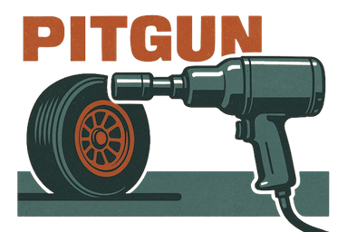

[](https://pitgun.io)

## What is Pitgun?
Pitgun is a modular Rust workspace for telemetry and high-frequency data processing.

## ⚠️ WARNING
 This repository is **under active development**. Interfaces may change.

## 🧱 Framework crates
- **pitgun-contract**: shared SimulationRequest/Result contract types
- **pitgun-core**: core library with domain types, processors, and sinks
- **pitgun-source-physics**: deterministic physics engine and telemetry generator
- **pitgun-source-physics-wasm**: WASM wrapper for browser/client usage
- **pitgun-codec-udp**: Pitgun UDP v1 encoding/decoding
- **pitgun-source-udp**: UDP transport source (codec-agnostic)
- **pitgun-codec-json**: SessionEnvelope JSON codec + SimulationRequest/Result JSON helpers
- **pitgun-source-ws**: WebSocket client source
- **pitgun-emulator**: UDP emitter that replays CSV telemetry with optional pacing

## 🧰 Apps
- **pitgun-cli**: command-line interface to ingest, transform, and export telemetry data (manifest-driven or flags)

## ⚙️ Current features
- Game/physics simulation source (`pitgun-source-physics`) with deterministic telemetry output
- Emit UDP packets from CSV datasets (real-time or as fast as possible)
- Subscribe over UDP and route through a pipeline of processors/sinks
- Processors:
  - `channel_filter` (whitelist channels)
  - `scale` (multiply one channel by a factor)
  - `segment_aggregate` (window by segment key with mean/max/min/stddev/count/sum)
  - `stats` (print per-channel counts/gaps)
- Sinks:
  - Console JSON printer
  - Per-channel CSV recording (optional)
- Declarative YAML manifest to assemble the pipeline (see `examples/manifests/udp_minimal.yaml`)
- Minimal binary frame format:
```
[len_channel:u16][channel][ts_csv:u128 LE][value:f64 LE]
```

## 🚀 Quickstart
1) Emit telemetry from CSV:
```bash
cargo run -p pitgun-emulator -- \
  --target 127.0.0.1:5001 \
  --input nEngine=data/inputs/f1/FIA-nEngine.csv \
  --input rThrottle=data/inputs/f1/Chassis-rThrottle.csv \
  --pace
```

2) Subscribe with a manifest-driven pipeline:
```bash
cargo run -p pitgun-cli -- subscribe --config examples/manifests/udp_minimal.yaml
```
`udp_minimal.yaml` includes a channel filter, a scale processor, and stats + console sink.

## Branching model

- `main`: stable, tagged milestones
- `feature/*`: active development
- `dev`: reserved for future integration needs (currently unused)

## 🧭 Backlog

- **Event reliability**  
  Sequence numbers, loss detection, and consistent semantics across sources.

- **Typed & shared wire format**  
  Unified serialization crate for sources, processors, and sinks.

- **Ecosystem expansion**  
  New sinks (Parquet, Kafka, Arrow), gRPC source, and manifest-driven pipelines.

- **Developer experience**  
  Bundle/Toolbox registry, improved CLI ergonomics, LLM-assisted manifest generation.

- **Performance & robustness**  
  Benchmarks, stress tests, memory profiling, and throughput optimisation.
