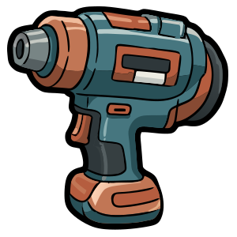

<p align="center">
  <a href="https://pitgun.com">
    
  </a>
</p>

<h1 align="center">Pitgun</h1>

<p align="center">
  <strong>Deterministic simulation to telemetry, in Rust.</strong>
</p>

<p align="center">
  Model · Simulate · Observe · Replay · Verify
</p>

<p align="center">
  <a href="https://github.com/loicbelec/pitgun/actions/workflows/pitgun-ci.yml"></a>
  <a href="LICENSE"></a>
  <br>
  
  <a href="https://github.com/loicbelec/pitgun/actions/workflows/pitgun-ci.yml"></a>
  <a href="https://github.com/loicbelec/pitgun/actions/workflows/pitgun-ci.yml"></a>
  
</p>

<p align="center">
  <a href="https://pitgun.com">Website</a> ·
  <a href="https://pitgun.dev">Developer blueprints</a> ·
  <a href="https://play.pitgun.com">Play Racing</a>
</p>

Pitgun is an experimental framework for building, running, observing, and
replaying deterministic time-series simulations. It connects versioned models
to reproducible execution, typed telemetry, and auditable replay.

Racing is Pitgun's first reference application and proving ground. The framework
is designed to become useful beyond motorsport wherever reproducible simulations,
event streams, and auditable results matter.

> [!IMPORTANT]
> Pitgun is an alpha-stage personal R&D project. Its deterministic contracts are
> being stabilized, but APIs and crate boundaries may still change.

## Run a Verified Simulation

Download a versioned binary from the
[GitHub Releases page](https://github.com/loicbelec/pitgun/releases),
extract it, enter its directory, then execute the complete local loop:

```bash
./pitgun --version
./pitgun demo racing --seed 42 --output ./pitgun-quickstart-run
```

The final line is the stable automation boundary:

```text
VERIFIED sha256:89dc458a7460056dd519f5cda74c55c2b2b47f7091f1309ae10d11a2eb46a64a
```

The [under-five-minute quickstart](docs/QUICKSTART.md) provides copy-paste
instructions for macOS, Linux, and workspace execution, including checksum
validation and a safe verification-failure exercise. No hosted Pitgun service,
account, or external database is required.

## The Simulation Loop

| Stage | Pitgun responsibility |
|---|---|
| **Model** | Define versioned domain inputs, contracts, registries, and physical parameters. |
| **Simulate** | Execute seeded logic consistently across native Rust and WebAssembly. |
| **Observe** | Emit typed events and telemetry through reusable ingestion and processing components. |
| **Replay and verify** | Preserve run identity and artifacts so results can be reproduced and compared. |

The long-term objective is not a universal physics engine. Pitgun provides the
deterministic execution and telemetry infrastructure; each application supplies
its own domain model and physical rules.

## What Exists Today

- A [deterministic run contract](docs/DETERMINISTIC_RUN_CONTRACT_V1.md) covering
  run identity, replay inputs, artifacts, and native/WASM comparison
- An optional [Resource Catalog contract](docs/RESOURCE_CATALOG_V1.md) separating
  simulation data from presentation metadata without changing V1 `run_id`
- Pure [Racing Catalog resolution](docs/CATALOG_RESOLUTION.md) for embedded,
  filesystem, and browser-provided bytes without network access in the core
- A versioned [stable RNG contract](docs/RNG_V1.md) with independently derived
  random streams
- A Racing golden scenario exercised in both native Rust and Node/WASM
- Published `run_id`, canonical Racing output, and telemetry summary digest vectors
- A versioned maximum-speed metric calculated from emitted typed telemetry
- Portable Run Bundle V1 replay and deterministic verification in a fresh process
- Racing physics, lap simulation, data packs, and browser-compatible WASM
- A physically resolved Racing Model V3 candidate with segment-aware track
  integration, explicit aero and transmission resolution, tire degradation,
  fuel-mass evolution, thermal state, and deterministic driver controls
- Domain-neutral telemetry envelopes, frames, and processing pipelines
- Replay and command-line tooling for operating local data flows
- Optional adapters for observed telemetry over UDP and WebSocket
- Operational Authority and Verifier services for signed authorization,
  independent replay, and server-owned verification verdicts
- Governed offline experiment campaigns backed by immutable manifests, Delta
  lineage, MLflow artifacts, and human-reviewed decisions

The Racing fixture now produces the same `run_id`, `output_digest`, and
`telemetry_summary_digest` in native Rust and Node/WASM. The checked-in canonical
artifacts are compared before their hashes so a regression identifies the first
changed result rather than only reporting a digest mismatch.

## Try the Deterministic Boundary

### Prerequisites

- A stable Rust toolchain
- Cargo
- Optional: Node.js and `wasm-pack` for the WASM check

Clone the repository and run the native Racing golden scenario:

```bash
git clone https://github.com/loicbelec/pitgun.git
cd pitgun
cargo test -p pitgun-solver --test racing_golden
```

Run the corresponding Node/WASM test:

```bash
cargo install wasm-pack --locked --version 0.14.0
wasm-pack test --node crates/pitgun-solver
```

For the entire Rust workspace:

```bash
cargo test --all
```

The CLI executes the versioned Racing scenario, collects typed telemetry, and
persists a validated deterministic run bundle locally:

```bash
cargo run -p pitgun-cli -- demo racing --seed 42
```

By default, the bundle is written below `./pitgun-runs/sha256-<run-id>/`. Use
`--output <PATH>` to select the exact destination. Repeating the same command
validates and reuses the immutable bundle rather than overwriting it.

It reports the observed maximum speed calculated by a domain-neutral telemetry
aggregator, reloads the committed bundle, replays its telemetry, and prints the
final `VERIFIED <run-id>` boundary. The standalone reader can verify the same
bundle in a fresh process:

```bash
cargo run -p pitgun-cli -- replay /path/to/run-bundle
```

The public behavior is specified in the
[Racing demo CLI contract](docs/RACING_DEMO_CLI_V1.md).
The portable files and their validation rules are documented in
[Deterministic Run Bundle V1](docs/RUN_BUNDLE_V1.md).

For offline experiment campaigns, including Databricks parameter sweeps, the
same Racing workload exposes a compact machine-readable boundary:

```bash
cargo run -p pitgun-cli -- run racing \
  --scenario apps/pitgun-cli/scenarios/racing-demo-v1.json \
  --seed 42
```

The command emits canonical JSON and does not require any network service or
database. See [Racing Batch Runner V1](docs/RACING_BATCH_RUNNER_V1.md) for the
input, output, failure, and optional full-bundle contracts.

## Framework and Racing

| | Framework | Racing |
|---|---|---|
| **Role** | Reusable deterministic simulation, telemetry, replay, and governance infrastructure | Reference application and realistic telemetry generator |
| **Owns** | Execution contracts, envelopes, pipelines, versioned run manifests, run identity, verification primitives | Cars, circuits, setups, strategies, lap physics, and race orchestration |
| **Purpose** | Support multiple deterministic time-series domains | Prove the framework against a concrete, engaging domain |

Motorsport remains central as the showcase: it makes simulation results visible,
creates useful datasets, and continuously tests native/WASM portability. It is
not intended to define the framework's generic abstractions.

## Runtime, Solver, and Simulator

Pitgun deliberately preserves three different responsibilities:

| Component | Responsibility |
|---|---|
| **Runtime** | Domain-neutral deterministic context, stable randomness, workload identity, and verification orchestration |
| **Solver** | Compute one domain's physical or mathematical solution |
| **Simulator** | Evolve domain state through logical time, invoke its Solver, and emit events and telemetry |

The Racing physical kernel is owned by `pitgun-racing-solver`; orchestration,
evidence and the statically linked workload are owned by
`pitgun-racing-simulator`, executed through `pitgun-runtime`. Transitional
`pitgun-solver` and `pitgun-simulator` compatibility paths remain while the game
and downstream consumers migrate. The runtime owns RNG V1, the generic linked
workload boundary, and filesystem-independent Run Bundle verification.
`pitgun-racing-contract` owns Racing wire schemas and domain consumers import it
directly. `pitgun-racing-policy` adapts those schemas to the generic policy
engine without introducing Racing semantics into `pitgun-policy`;
`pitgun-contract` remains domain-neutral.
[ADR 0001](docs/adr/0001-runtime-and-domain-workloads.md) fixes the dependency
direction and explains why Pitgun does not claim a universal Solver before a
second domain proves the abstraction.

The stable CLI demo deliberately remains backed by the immutable
[`pitgun.racing@1.0.0`](catalogs/racing/v1.0.0/catalog.json) reference catalog.
Its Simulation Pack contains the physical resources used by native and WASM
execution; its separate Presentation Pack supplies the browser-facing labels
without affecting deterministic identity.

Later immutable releases evolve the Racing proving ground without rewriting
that public fixture. The current governed candidate is
[`pitgun.racing@1.9.0`](catalogs/racing/v1.9.0/catalog.json), compatible with
`pitgun.racing-v3-candidate@0.15.0`. It adds the explicit full-distance fuel
contract and is the subject of the latest multi-circuit acceptance campaign;
it is not a mutable alias for the V1 quickstart.

## Architecture at a Glance

The primary architecture follows the deterministic loop rather than a transport
stack:

| Role | Responsibility | Main components |
|---|---|---|
| **Core contract** | Define versioned scenarios, telemetry frames, run identity, and canonical evidence | `crates/pitgun-contract` |
| **Deterministic runtime** | Execute linked workloads and verify reproducible runs | `crates/pitgun-runtime` |
| **Reference workload** | Solve Racing physics, orchestrate races, and expose WASM | `pitgun-racing-solver`, `pitgun-racing-simulator` |
| **Telemetry processing** | Transform and aggregate generated or observed channels | `crates/pitgun-core` |
| **Replay and tooling** | Run, inspect, replay, and verify local artifacts | `apps/pitgun-cli`, `apps/pitgun-replay` |
| **Hosted governance** | Constrain, sign, independently replay, and audit distributed runs | `crates/pitgun-policy`, `crates/pitgun-racing-policy`, `crates/pitgun-signing`, `services/pitgun-authority`, `services/pitgun-verifier` |
| **Observed-data integrations** | Capture external telemetry for comparison, calibration, processing, or later replay | `pitgun-source-udp`, `pitgun-source-ws`, `pitgun-codec-*` |

```text
crates/     reusable framework and simulation crates
apps/       operator and developer tools
services/   deployable runtime services
docs/       contracts, architecture, and technical documentation
policies/   policy samples
```

The complete crate and transport inventory remains available in
[Architecture](ARCHITECTURE.md). Experimental Kafka and MQTT adapters are not
part of the primary simulation path or quickstart.

The supported [executable examples](docs/EXAMPLES.md) distinguish the primary
verified Racing loop from optional observed-data processing. Historical
manifest prototypes are not public compatibility contracts.

## Observed Data Integrations

Pitgun-generated telemetry is the primary data path. UDP and WebSocket adapters
also allow the framework to capture telemetry from an external system for
comparison with a model, calibration, processing, or deterministic replay.

An external stream is not deterministic: its timing, ordering, and availability
belong to the operating environment. Once captured as a versioned artifact,
however, Pitgun can process and replay that recorded data reproducibly. These
adapters therefore sit outside the deterministic simulation kernel.

## Optional Hosted Verification

Pitgun can authorize a deterministic attempt centrally, execute it in an
untrusted browser through Rust/WASM, preserve its evidence in a local outbox,
and independently replay it before a result becomes eligible for a trusted
projection such as a leaderboard.

```text
Authority -> signed attempt -> browser/WASM -> evidence -> integrating backend
     ^                                                   |
     |                                                   v
 policy + catalog                              Verifier replay + verdict
```

The Authority signs the exact model, Simulation Pack, policy, subject, and
execution envelope it accepts. The Verifier trusts neither the browser result
nor a client-provided verdict: it resolves retained immutable resources,
recomputes identities and digests, then replays the workload. Availability is
deliberately asymmetric: an already authorized attempt can finish and retry
submission from the outbox, while a run invented during an Authority outage
cannot be retroactively promoted as verified.

These services are optional. The local CLI demo does not require an account,
network service, or hosted database. See the
[Authority](services/pitgun-authority/README.md),
[Verifier](services/pitgun-verifier/README.md), and
[verification verdict](docs/VERIFICATION_VERDICT_V1.md) contracts.

## Optional Telemetry Ingestion

The Gateway is a separate hosted boundary for authenticated, versioned
WebSocket event ingestion into append-only PostgreSQL storage. It does not
authorize simulations, verify results, build Racing summaries, or select
models. This separation keeps transport and observed-data concerns out of the
deterministic execution path.

```bash
PITGUN_GATEWAY_API_KEY=dev-secret \
PITGUN_GATEWAY_BIND=127.0.0.1:8080 \
cargo run -p pitgun-gateway --release
```

```bash
curl -fsS http://127.0.0.1:8080/health
```

Gateway payloads and configuration are documented in
[`services/pitgun-gateway`](services/pitgun-gateway/README.md).

## Governed Experimentation

Pitgun reuses the same Rust workload offline for larger parameter campaigns.
A coarse local screen narrows the response surface; reviewed Databricks jobs
then execute immutable matrices with resumable natural keys, normalized Delta
evidence, MLflow artifacts, exact source and model lineage, and an explicit
human decision. Databricks can propose evidence, but it cannot mutate a catalog,
publish an opponent policy, or become a runtime dependency of the game.

This process has already falsified an important assumption. The historical
105-run V1 circuit sweep selected the same high-downforce, short-gearing setup
on all five circuit archetypes. Rather than encoding cosmetic AI variety,
Pitgun used that negative result to expose weaknesses in the old response
surface and evolve the physical model. The latest Catalog 1.9 acceptance gate
reconciled 135 full-distance simulations and 1,485 metrics over pinned Delta
snapshots, then recorded a human `ACCEPT` decision while retaining Monza as an
expected specialization and Suzuka as an explicit observation.

The complete workflow, commands, limitations, and reviewed artifacts are in
[Databricks experiments](experiments/databricks/README.md). The original
falsification remains documented in
[Databricks Circuit Sweep V1](docs/DATABRICKS_CIRCUIT_SWEEP_V1.md).

## Deployment Ownership

This repository builds and tests the framework, publishes CLI artifacts, and
publishes immutable service images. It does not own staging or production
runtime configuration.

- `docker-compose.dev.yml` is the only supported Compose entry point in this
  repository and is a narrow gateway/authority component-development harness.
- `loicbelec/infra-vps` is the canonical source for staging and production
  Compose stacks, routing, persistence, observability, deployment workflows,
  and complete local platform integration.
- Production services run from published container images; repository checkouts,
  systemd units, and framework-local production Compose files are unsupported.

For a minimal local service stack:

```bash
docker compose -f docker-compose.dev.yml up -d --build
curl -fsS http://127.0.0.1:8080/health
curl -fsS http://127.0.0.1:8081/readyz
curl -fsS http://127.0.0.1:8082/readyz
docker compose -f docker-compose.dev.yml down
```

This starts PostgreSQL, `pitgun-gateway`, `pitgun-authority`, and
`pitgun-verifier`. Use the local
stack in `loicbelec/infra-vps` for end-to-end platform integration with the game
APIs and optional observability services.

## Roadmap

The current sequence remains proof-driven:

1. Preserve the stable V1 CLI and native/WASM verification boundary while the
   Racing application evolves through immutable catalogs.
2. Expose deterministic incremental session execution and telemetry streaming
   without weakening replay or Hosted Verification —
   [#312](https://github.com/loicbelec/pitgun/issues/312).
3. Complete Model V3 component composition and retire transitional Racing
   compatibility crates when downstream consumers have migrated —
   [#313](https://github.com/loicbelec/pitgun/issues/313) and
   [#117](https://github.com/loicbelec/pitgun/issues/117).
4. Introduce staged combustion and hybrid-energy accounting through versioned
   model capabilities — [#246](https://github.com/loicbelec/pitgun/issues/246).
5. Reuse the proven fixed-path energy concepts for the Era 7 Pod/Drone bridge,
   then validate the framework with a genuinely distinct simulation domain —
   [#247](https://github.com/loicbelec/pitgun/issues/247).
6. Measure native, WASM, browser, and hosted replay costs after the physical
   model work stabilizes — [#279](https://github.com/loicbelec/pitgun/issues/279).

## Documentation

- [Public schemas](https://schemas.pitgun.io) — versioned telemetry, manifest, and integration contracts
- [Architecture](ARCHITECTURE.md) — components, data flow, and ownership
- [Framework boundaries](docs/FRAMEWORK_BOUNDARIES.md) — generic and Racing separation
- [Racing Model Constitution V1](docs/RACING_MODEL_CONSTITUTION_V1.md) — physical-model ownership, claims, invariants, and versioning
- [Racing Era Capability Matrix V1](docs/RACING_ERA_CAPABILITY_MATRIX_V1.md) — implemented and target capabilities across the seven game eras
- [Racing Parameter Inventory V1](docs/RACING_PARAMETER_INVENTORY_V1.md) — coefficients, defaults, dead inputs, ownership, and evidence status
- [Racing Model Approximation Audit V1](docs/RACING_MODEL_APPROXIMATION_AUDIT_V1.md) — equation review, validity domains, Game/Reference fidelity, and Model V3 direction
- [Racing Model V3 fuel contract V1](docs/RACING_V3_FUEL_CONTRACT_V1.md) — explicit full-distance mass and consumption boundary in Catalog 1.9
- [Deterministic driver instructions V1](docs/RACING_DETERMINISTIC_DRIVER_INSTRUCTIONS_V1.md) — replayable mode timelines and future live-control boundary
- [Racing Model V3 tire degradation](experiments/racing_v3_tire_degradation/README.md) — compound wear law, diagnostics, local evidence, and governed Databricks replay
- [Racing Model V3 Unified Decision Screen V1](docs/RACING_V3_UNIFIED_DECISION_SCREEN_V1.md) — exact 0.9 mechanical activation, setup diversity, development trade-offs, and linked long-run evidence
- [Racing Game Vehicle Contract V1](docs/RACING_GAME_VEHICLE_CONTRACT_V1.md) — governed vehicle unlocks across enabled game eras and Catalog 1.3.0
- [Racing demo CLI contract](docs/RACING_DEMO_CLI_V1.md) — command, bundle layout, report, and failures
- [Racing batch runner V1](docs/RACING_BATCH_RUNNER_V1.md) — resolved scenario input and canonical compact result
- [Under-five-minute quickstart](docs/QUICKSTART.md) — workspace and prebuilt installation paths
- [Release process](docs/RELEASING.md) — immutable tags, binary targets, and publication checks
- [Catalog publication](docs/CATALOG_PUBLISHING.md) — immutable Resource Catalog deployment and rollback
- [Catalog resolution](docs/CATALOG_RESOLUTION.md) — native and browser byte validation before execution
- [Databricks experiments](experiments/databricks/README.md) — governed sweeps, Delta/MLflow lineage, review gates, and non-runtime boundaries
- [ADR 0001](docs/adr/0001-runtime-and-domain-workloads.md) — generic runtime and domain Solver/Simulator ownership
- [ADR 0002](docs/adr/0002-optional-versioned-catalogs.md) — optional versioned Resource Catalogs and resolved scenarios
- [Deterministic Run Bundle V1](docs/RUN_BUNDLE_V1.md) — portable artifacts, identities, persistence, and validation
- [Deterministic run contract v1](docs/DETERMINISTIC_RUN_CONTRACT_V1.md) — identity, reproducibility, and replay
- [Stable RNG v1](docs/RNG_V1.md) — generator and stream derivation algorithms
- [Statically linked workloads](docs/LINKED_WORKLOAD.md) — model/input binding, execution context, and evidence hooks
- [Loaded Run Bundle verification](docs/RUN_BUNDLE_VERIFICATION.md) — pure evidence verification and storage-adapter boundary
- [Wire formats](docs/WIRE_FORMATS.md) — protocol specifications
- [Command reference](docs/commands.md) — current CLI usage
- [Documentation index](docs/index.md) — complete technical map

The visual architecture blueprints at [pitgun.dev](https://pitgun.dev) complement
these repository-level contracts.

## Contributing

Issues and focused pull requests are welcome. Before pushing, run the same local
quality gate used by the project:

```bash
./scripts/pre-commit-checks.sh
```

CI protects the general build, the hermetic Racing scenario-to-`VERIFIED` loop,
the native/WASM golden boundary, and release packaging through the `build`,
`racing-e2e`, `wasm-golden-run`, and `release-binary` jobs.

## License

Pitgun Framework is available under the [MIT License](LICENSE).
