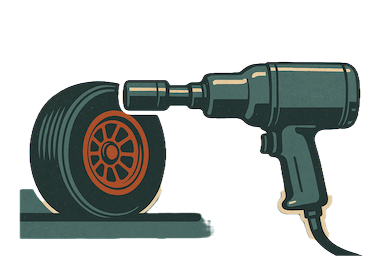
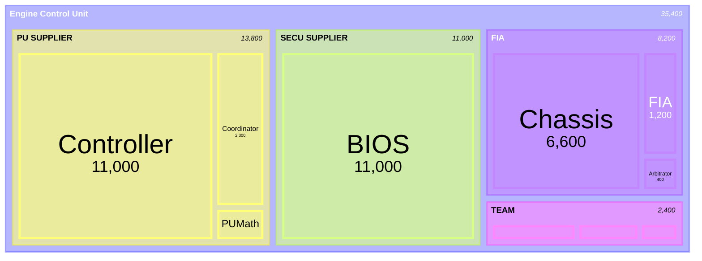

[](https://pitgun.loicbelec.com)

# Pitgun development journal

## Introduction

**Pitgun** is my personal journey into building a modular telemetry and data processing framework in Rust. 

The project explores how to ingest, emulate, and analyze high-frequency data streams - similar to those used in Formula 1 telemetry systems - while applying modern Rust concepts and patterns.

### 🎯 Goals  
- Learn and apply modern Rust in a real-world, performance-critical context  
- Build a modular, low-latency data pipeline  
- Experiment with UDP streaming, parallel ingestion, and high-frequency emulation  
- Bridge **Formula 1 telemetry** with **High-Frequency Trading (HFT)** paradigms - both domains where *latency and precision decide winners*  

This repository is a **learning log**. I’m documenting not just the code, but the thought process, mistakes, and lessons along the way.  

By combining insights from **Formula 1 telemetry** and **High-Frequency Trading**, Pitgun is my sandbox to experiment with ultra-low-latency data systems.

## Table of contents
- [Introduction](#introduction)
- [Project Structure](#project-structure)
- [Roadmap](#roadmap)
- [1 - Emitting data from a single channel over UDP](#1---emitting-data-from-a-single-channel-over-udp)
- [2 - Parallel processing (WIP)](#2---parallel-processing)

## Project structure
Pitgun is organized as a Rust workspace composed of several crates:

| Crate | Purpose |
|-------|----------|
| `pitgun-core` | Core library: data structures, parsing, pipeline operators |
| `pitgun-cli` | Command-line interface: ingest, transform, export |
| `pitgun-emulator` | UDP emitter: replays CSV datasets at configurable pace |

## Roadmap
- [x] Create Rust workspace with `core`, `cli`, `emulator`  
- [x] Implement UDP emission from CSV datasets  
- [ ] Add sequence numbers and loss detection
- [ ] Explore sinks: Parquet, Kafka, Arrow  
- [ ] Add benchmarks and performance profiling  
- [ ] Study parallels with HFT market data (UDP multicast, order books, latency profiling)  
- [ ] Publish crates on [crates.io](https://crates.io) when stable 

## 1 - Emitting data from a single channel over UDP

### Context

In **Formula 1**, telemetry is both a technological backbone and a closely guarded secret. Every team uses the [Atlas Ecosystem](https://www.motionapplied.com/products/ATLAS), developed by *Motion Applied* (formerly *McLaren Applied*), which provides a complete data acquisition toolchain - from the ECU (Electronic Control Unit) in the car to the dashboard software you see lighting up in the pitlane.

Telemetry is split into several channels. One stream is sent directly to the FIA, which monitors a subset of live telemetry data in real time to enforce sporting and technical regulations. These streams travel through the paddock network using **UDP multicast**, allowing broadcast to multiple recipients - but each flow is **encrypted**, ensuring teams cannot read each other’s data.

### Objective

My first objective is to reproduce a minimalistic version of this system - a first step toward a modular telemetry framework capable of emulating real F1 data flow with synthetic data.

### Implementation

The first channel I picked to emulate is the engine speed, known under the Atlas namespace as `FIA-nEngine`.

Here are the design goals:
- **Data source:** simple CSV time series.
- **Transport:** UDP multicast to mimic trackside broadcast patterns.
- **Encryption:** lightweight XOR-style scrambling (placeholder for proprietary ciphers).
- **Replay pacing:** optional pacing to preserve timing between samples.

[](https://pitgun.loicbelec.com)

Example dataset for this channel:
```csv
Timestamp,ChannelValue
62076104000000,12034.5
62076105000000,12035.2
```

The channel name is inferred from the CSV filename, e.g. `FIA-nEngine.csv` → channel `FIA-nEngine`. Each row in the CSV is replayed over UDP: by default as fast as possible, or paced with `--pace` to reproduce real sample intervals based on the `Timestamp` column.

#### Command-line flags

| Flag | Type | Default | Description |
|:-----|:------|:---------|:-------------|
| `--target <HOST:PORT>` | `String` | *(required)* | Target address, e.g. `239.10.0.1:5001` for multicast or `127.0.0.1:5001` for unicast. |
| `--csv <PATH>` | `Path` | *(required)* | Path to the input CSV file (with headers `Timestamp,ChannelValue`). |
| `--pace` | `bool` | `false` | Respect CSV timing (pacing based on timestamp deltas). If not set, the file is replayed as fast as possible. |
| `--channel <STRING>` | `Option<String>` | *(default = filename stem)* | Override the default channel name derived from the CSV filename. |
| `--mcast-ttl <u32>` | `1` | Time-to-Live value for multicast packets. Ignored for unicast targets. |

#### Example usage

```bash
pitgun-emulator \
  --target 239.10.0.1:5001 \
  --csv datasets/telemetry/FIA-nEngine.csv \
  --pace
```

### Pitgun UDP packet
Each telemetry frame emitted by the emulator is encoded into a compact binary structure designed for low-latency transmission over UDP.

The layout prioritizes simplicity and deterministic parsing - no headers, padding, or delimiters beyond what’s strictly necessary.


channel    = "FIA-nEngine"
ts_csv_ns  = 62076104000000
value      = 1234.5
```

the serialized bytes look like this:

```
╔════════════════════════════════════════════════════════════════════════╗
║  Field             │ Bytes (hex)                                       ║
╟────────────────────┼───────────────────────────────────────────────────╢
║ len_channel (11)   │ 0B 00                                             ║
║ "FIA-nEngine"      │ 46 49 41 3A 6E 45 6E 67 69 6E 65                  ║
║ ts_csv_ns          │ 00 C0 5F 73 63 00 00 00 00 00 00 00 00 00 00 00   ║
║ value (1234.5)     │ 00 00 00 00 00 49 93 40                           ║
╚════════════════════════════════════════════════════════════════════════╝
```

*(All fields use **little-endian** encoding to align with Rust’s native layout on x86 platforms.)*

#### Reference implementation

```rust
/// Binary frame layout:
/// [len_channel: u16][channel][ts_csv_ns: u128 LE][value: f64 LE]
fn encode_frame(channel: &str, ts_csv_ns: u128, value: f64) -> Vec<u8> {
    let name = channel.as_bytes();
    let mut buf = Vec::with_capacity(2 + name.len() + 16 + 8);
    let len = u16::try_from(name.len()).unwrap_or(u16::MAX);
    buf.extend_from_slice(&len.to_le_bytes());
    buf.extend_from_slice(name);
    buf.extend_from_slice(&ts_csv_ns.to_le_bytes());
    buf.extend_from_slice(&value.to_le_bytes());
    buf
}
```

#### Notes
- The frame is **self-delimiting**: the first two bytes define the length of the channel name.  
- No CRC or sequence number is included — Pitgun assumes reliable transmission within local or simulated networks.  
- This layout is minimal by design: easy to deserialize, endian-safe, and ideal for high-frequency telemetry streams.

### Architecture notes

The emulator follows a layered architecture that mirrors a real telemetry stack.  
Data first flows from CSV ingestion, where raw samples are read and timestamped, into a processing layer that handles pacing, frame encoding, and optional cryptographic operations. The resulting binary frames are then transmitted over UDP, completing the transport stage.  

Each input file represents an independent telemetry channel - for example, `FIA-nEngine` or `Arbitrator-rThrottlePedal` - allowing multiple streams to coexist and simulate distributed sensors.  

The network layer aims for realism: it supports multicast group joins, dynamic packet sizing, and a low-latency send path to emulate real-time behavior. A lightweight security stub is also included, providing a pluggable crypto module so that the current XOR cipher can later be replaced by stronger encryption schemes without changing the framing logic.

### What’s next?

- Extend to multi-channel replay with parallel workers.  
- Add session context (car, stint, lap) and synchronize timestamps.  
- Build a receiver tool to monitor packet loss and latency.  
- Define a versioned binary format for future compatibility.

## 2 - Parallel processing

### Context

This treemap illustrates the internal structure of the Formula 1 Engine Control Unit (ECU) based on telemetry channel volume.
Each block represents a logical subsystem within the ECU - from real-time control loops to data logging and chassis coordination.

The Controller and TAG320BIOS dominate, handling nearly half of all runtime signals: the former executes the ECU scheduler and control logic, while the latter manages low-level logging, BIOS states, and diagnostic coverage. Around them, the Chassis, Coordinator, and BrakeControl modules form the backbone of vehicle dynamics and safety. Finally, smaller application layers such as Dash and regulatory interfaces like FIA complete the overall architecture.

Together, these components show how a modern F1 ECU combines control, orchestration, and observability into a single embedded platform.



The ECU exposes tens of thousands of channels. Many are **low-frequency “slow raw”** signals, but a critical subset runs at **high frequency** (e.g., engine speed). To get closer to real track conditions, we now emit multiple high-frequency channels in parallel.

Alongside the engine speed, we introduce the throttle pedal amplitude: `rThrottlePedal`. The goal is to simulate at least two high-frequency streams over UDP with realistic pacing and clean separation by channel.

### Objective

My objective is to emit **2 high-frequency channels** (e.g., `nEngine`, `rThrottlePedal`) from CSVs.

I will maintain the minimal wire format from the first chapter:
```
[len_channel:u16][channel][ts_csv_ns:u128 LE][value:f64 LE]
```

### Implementation

#### K-Way merge for telemetry streams

The [k-way merge](https://en.wikipedia.org/wiki/K-way_merge_algorithm) is a classic algorithmic pattern used to merge several already-sorted input streams into a single globally-sorted output stream. Here, k denotes the number of channels (CSV files) being merged.

Each telemetry file in Pitgun - for example `FIA-nEngine.csv`, `Arbitrator-rThrottlePedal.csv`, or `Chassis-NGear.csv` - is sorted by timestamp.
The emulator opens one cursor per file, each cursor holding the next unread row.
At every iteration, it picks the cursor with the **smallest pending timestamp**, emits that sample, and then advances only that cursor.

This produces a monotonically increasing global timeline across all channels:

```mermaid
timeline
    ts = 653 004 000 : nEngine = 0
        : rThrottlePedal = 0.6
    ts = 654 004 000 : nEngine = 0
    ts = X : nEngine = Y
    ts = 662 004 000 : nEngine = 0
    ts = 663 004 000 : nEngine = 0
        : rThrottlePedal = 0.6
````

Algorithmically, this behaves like the merge step in a multi-way mergesort and runs in $O(N*log(k))$ time with $O(k)$ memory. It is an essential pattern for real-time telemetry replay, ensuring deterministic ordering and synchronized pacing across multiple sensor or ECU channels.

#### Unicast vs multicast networking modes

The emulator supports both unicast and multicast UDP transmission, which define who receives the datagrams.

##### Unicast - Point-to-Point

*“Send to one specific host.”*

The target is a regular IPv4 address, such as `127.0.0.1:5001` or `192.168.1.42:5001`. Packets are delivered to exactly one receiver. This mode is ideal for local testing or one-to-one communication between the emulator and a single analysis tool.

##### Multicast - One-to-Many

*“Broadcast to everyone listening on a group address.”*

The target lies in the multicast address range `224.0.0.0` - `239.255.255.255`, for example `239.10.0.1:5001`. Any host that has joined this multicast group will receive the same packets simultaneously. This is the standard model for motorsport telemetry distribution where multiple engineering clients subscribe to identical real-time feeds (strategy, power-unit, simulation etc.).

In Pitgun, the socket layer automatically detects whether the destination is multicast (first octet 224–239) and adjusts its configuration: `set_multicast_ttl_v4(ttl)` and `set_multicast_loop_v4(false)` ensure proper propagation and prevent echoing packets back to the sender.

#### Example usage

```bash
pitgun-emulator \
  --target 239.10.0.1:5001 \
  --input nEngine=datasets/telemetry/RUN-001/FIA-nEngine.csv \
  --input throttle=datasets/telemetry/RUN-001/Controller-rThrottleR.csv \
  --pace
```

#### Reference implementation

The following code shows the core of Pitgun’s multi-channel telemetry replay loop. Each input CSV represents an independent telemetry stream. The loop maintains one cursor per channel, performs a k-way merge based on timestamps, and emits synchronized frames in real time over UDP.

```rust
// --- Reference implementation: multi-channel replay loop ---
let mut cursors = open_all_channels(args.input)?;
let t0_ns = cursors
    .iter()
    .filter_map(|c| c.next.as_ref().map(|r| r.ts))
    .min()
    .expect("no data");
let start = Instant::now();

loop {
    // Pick the next record globally (k-way merge)
    let Some(i) = cursors
        .iter()
        .enumerate()
        .filter_map(|(i, c)| c.next.as_ref().map(|r| (i, r.ts)))
        .min_by_key(|(_, ts)| *ts)
        .map(|(i, _)| i)
    else { break };

    let (channel, ts, val) = {
        let c = &mut cursors[i];
        let row = c.next.take().unwrap();
        (c.channel.clone(), row.ts, row.val)
    };

    // Optional pacing: wait until real time catches up
    if args.pace {
        let delay = Duration::from_nanos((ts - t0_ns) as u64);
        if let Some(rem) = delay.checked_sub(start.elapsed()) {
            std::thread::sleep(rem);
        }
    }

    // Encode and emit the frame
    let frame = encode_frame(&channel, ts, val);
    sock.send(&frame)?;

    // Advance this channel
    cursors[i].next = cursors[i].it.next().transpose()?;
}
```

This minimal loop encapsulates Pitgun’s design principles: concurrency through independent cursors, deterministic ordering through k-way merging, and controlled real-time pacing for accurate telemetry replay.

### Architecture notes

The current version of Pitgun introduces a clear and modular architecture.
Each component has a focused role. The core handles data and timing logic, while dedicated adapters (`pitgun-source`, `pitgun-sink`) deal with I/O like UDP, gRPC, or Parquet.
This separation makes it easy to extend the system later without rewriting the core.

The replay engine itself is deterministic: it merges multiple telemetry channels using a k-way merge, ensuring that data from all sensors is emitted in correct chronological order.
Timing accuracy is preserved, and the optional pacing mode reproduces real-time playback.

Memory usage stays low since only one row per channel is buffered, which scales well even when replaying many channels at once.
The result is a lightweight and predictable system that behaves like a real telemetry feed.

With this foundation, Pitgun now moves from a simple file replayer toward a full telemetry platform  capable of streaming, recording, and analyzing data consistently across different environments.

### What’s next?

- ~~Extend to multi-channel replay with parallel workers.~~ ✅  
- ~~Add session context (car, stint, lap) and synchronize timestamps.~~ ✅ 
- Build a receiver tool to monitor packet loss and latency.    
- Implement a gRPC streaming interface (`pitgun-proto`) to allow remote clients to subscribe to telemetry.  
- Add a Kafka adapter (`pitgun-source-kafka`) for distributed replay and persistence.  
- Introduce a Parquet sink for offline storage and analysis.  
- Expose Prometheus metrics for rate, latency, and packet loss.  
- Support declarative configuration files (YAML/TOML) for complex sessions.  

> The goal is to evolve *Pitgun* from a standalone emulator into a modular telemetry platform —  
> capable of streaming, recording, and analyzing real-time and historical data in a consistent way.

## 3 - Definition of events

### Context

Before diving into channel processing, it is essential to introduce the concept of events. An event is a **logical condition applied to one or more acquisition channels** and is widely used in motorsport to compute metrics within specific operating contexts.

A context describes the situation the car is in. For example, *the car is entering the pitlane*. We can express this as a condition on a spatial signal:
$$
s_{\text{Pitlane}}(t) > 0
$$

In that context, *the engine speed within the pitlane* is then interpreted as:
$$
n_{\text{Engine}}(s_{\text{Pitlane}})
$$

#### Applications of event-gated data

Event gating lets you analyze signals only within relevant operational windows. Typical applications include:

- **Energy management** - isolating power flows between battery, MGUs (kinetic/thermal), and ICE.  
- **Component wear / damage estimation** - assessing stress or fatigue under specific loads.  
- **Performance analysis** - comparing driver inputs during accel/brake/lift phases.  
- **Calibration validation** - monitoring control parameters in defined modes (pit limiter, safety car, full-load).  
- **Thermal management** - gating by coolant/oil temperature windows.  
- **Fuel consumption modeling** - gating steady-state cruise vs. transient.  

> 💬 Note à moi-même : ajouter des cas supplémentaires

#### Practical Considerations

Channels often differ in sampling rate and latency, so you must **align** them when applying events. Two common strategies:

1) **Direct gating (no interpolation)**  
   Use only samples that fall inside active event intervals.  
   → Maximizes temporal fidelity, data may be sparse.

2) **Interpolated/resampled gating**  
   Interpolate or resample channels so the event mask and signals align on a common grid.  
   → Maximizes continuity, introduces interpolation assumptions.

| Strategy            | Pros                               | Cons                              |
|---------------------|------------------------------------|-----------------------------------|
| Direct gating       | Exact timestamps; no assumptions   | Irregular samples; gaps possible  |
| Interp./resampled   | Smooth, aligned arrays for metrics | Interpolation bias/phase risks    |

### Mathematical definition

#### Channels

Let a set of channels

$$
\mathcal{C} = \{ C_1, C_2, \dots, C_n \}
$$

where each channel $C_i : \mathbb{R} \to \mathbb{R}$ is a function of time $t$ (sampled in practice).

**Examples:**

$$
C_1(t) = n_\text{Engine}(t), \quad
C_2(t) = v_\text{Car}(t), \quad
C_3(t) = R_\text{Throttle}(t)
$$

#### Predicate or condition

A predicate is a logical expression applied to one or more channels:

$$
\varphi : \mathbb{R}^n \to \{ \text{True}, \text{False} \}
$$

**Examples:**

$$
\begin{aligned}
\varphi_1(x_1,x_2) &: x_1 > 12000 \quad &&\text{(high engine speed)} \\
\varphi_2(x_1,x_2) &: x_2 < 50 \quad &&\text{(vehicle speed below 50 km/h)} \\
\varphi_3(x_1,x_2,x_3) &: (x_1 > 9000) \land (x_3 > 0.8) \quad &&\text{(high revs AND high throttle)}
\end{aligned}
$$

#### Elementary Event

An elementary event associated with a predicate $φ$ is the Boolean signal:

$$
E_\varphi(t) =
\begin{cases}
1 & \text{if } \varphi(C_1(t), C_2(t), \dots, C_n(t)) \text{ is true},\\[4pt]
0 & \text{otherwise.}
\end{cases}
$$

Compact notation:

$$
E_\varphi(t) = \mathbf{1}\{\varphi(\mathbf{C}(t))\}
$$

Hence, $E_\varphi : \mathbb{R} \to \{0,1\}$ is a Boolean time series.

#### Edges and active intervals

Define the **rising** and **falling** edges of $E_\varphi(t)$:

$$
\begin{aligned}
t_i^{\uparrow} &= \{ t \mid E_\varphi(t^-) = 0, \; E_\varphi(t^+) = 1 \}, \\
t_i^{\downarrow} &= \{ t \mid E_\varphi(t^-) = 1, \; E_\varphi(t^+) = 0 \}.
\end{aligned}
$$

Each pair $[t_i^{↑}, t_i^{↓})$ defines a time segment during which the event is active:

$$
\mathcal{S}_\varphi = \bigcup_i [t_i^{\uparrow},\, t_i^{\downarrow})
$$

#### Duration and frequency

- **Total active duration**

$$
T_\varphi = \sum_i (t_i^{\downarrow} - t_i^{\uparrow})
$$

- **Number of occurrences**

$$
N_\varphi = |\mathcal{S}_\varphi|
$$

- **Duty ratio (occupancy)**

$$
\rho_\varphi = \frac{T_\varphi}{T_\text{total}}
$$

#### Composite Events

Events can be **combined** with logical operators:

$$
\begin{aligned}
E_{\varphi_1 \land \varphi_2}(t) &= E_{\varphi_1}(t) \cdot E_{\varphi_2}(t) \\
E_{\varphi_1 \lor \varphi_2}(t) &= \max(E_{\varphi_1}(t), E_{\varphi_2}(t)) \\
E_{\neg \varphi_1}(t) &= 1 - E_{\varphi_1}(t)
\end{aligned}
$$

These operations allow composite rules, such as *“high rpm AND high throttle”*, *“boost AND brake”*, etc.

#### Example

Let

$$
\varphi_1: n_\text{Engine} > 10000, \qquad
\varphi_2: T_\text{Throttle} > 0.8
$$

Then

$$
E_{\varphi_1}(t) = \mathbf{1}\{ n_\text{Engine}(t) > 10000 \}, \quad
E_{\varphi_2}(t) = \mathbf{1}\{ T_\text{Throttle}(t) > 0.8 \}
$$

and

$$
E_\text{PowerRun}(t) = E_{\varphi_1}(t) \land E_{\varphi_2}(t)
$$

The active intervals correspond to periods with *"high engine speed AND high load"*.