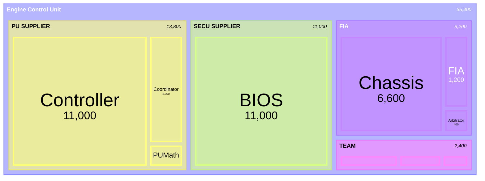

[](https://pitgun.loicbelec.com)

# Pitgun development journal

## Introduction

**Pitgun** is my personal journey into building a modular telemetry and data processing framework in Rust. 

The project explores how to ingest, emulate, and analyze high-frequency data streams - similar to those used in Formula 1 telemetry systems - while applying modern Rust concepts and patterns.

### 🎯 Goals  
- Learn and apply modern Rust in a real-world, performance-critical context  
- Build a modular, low-latency data pipeline  
- Experiment with UDP streaming, parallel ingestion, and high-frequency emulation  
- Bridge **Formula 1 telemetry** with **High-Frequency Trading (HFT)** paradigms - both domains where *latency and precision decide winners*  

This repository is a **learning log**. I’m documenting not just the code, but the thought process, mistakes, and lessons along the way.  

By combining insights from **Formula 1 telemetry** and **High-Frequency Trading**, Pitgun is my sandbox to experiment with ultra-low-latency data systems.

## Table of contents
- [Introduction](#introduction)
- [Project Structure](#project-structure)
- [Roadmap](#roadmap)
- [1 - Emitting data from a single channel over UDP](#1---emitting-data-from-a-single-channel-over-udp)
- [2 - Parallel processing (WIP)](#2---parallel-processing)

## Project structure
Pitgun is organized as a Rust workspace composed of several crates:

| Crate | Purpose |
|-------|----------|
| `pitgun-core` | Core library: data structures, parsing, pipeline operators |
| `pitgun-cli` | Command-line interface: ingest, transform, export |
| `pitgun-emulator` | UDP emitter: replays CSV datasets at configurable pace |

## Roadmap
- [x] Create Rust workspace with `core`, `cli`, `emulator`  
- [x] Implement UDP emission from CSV datasets  
- [ ] Add sequence numbers and loss detection
- [ ] Explore sinks: Parquet, Kafka, Arrow  
- [ ] Add benchmarks and performance profiling  
- [ ] Study parallels with HFT market data (UDP multicast, order books, latency profiling)  
- [ ] Publish crates on [crates.io](https://crates.io) when stable 

## 1 - Emitting data from a single channel over UDP

### Context

In **Formula 1**, telemetry is both a technological backbone and a closely guarded secret. Every team uses the [Atlas Ecosystem](https://www.motionapplied.com/products/ATLAS), developed by *Motion Applied* (formerly *McLaren Applied*), which provides a complete data acquisition toolchain - from the ECU (Electronic Control Unit) in the car to the dashboard software you see lighting up in the pitlane.

Telemetry is split into several channels. One stream is sent directly to the FIA, which monitors a subset of live telemetry data in real time to enforce sporting and technical regulations. These streams travel through the paddock network using **UDP multicast**, allowing broadcast to multiple recipients - but each flow is **encrypted**, ensuring teams cannot read each other’s data.

### Objective

My first objective is to reproduce a minimalistic version of this system - a first step toward a modular telemetry framework capable of emulating real F1 data flow with synthetic data.

### Implementation

The first channel I picked to emulate is the engine speed, known under the Atlas namespace as `FIA-nEngine`.

Here are the design goals:
- **Data source:** simple CSV time series.
- **Transport:** UDP multicast to mimic trackside broadcast patterns.
- **Encryption:** lightweight XOR-style scrambling (placeholder for proprietary ciphers).
- **Replay pacing:** optional pacing to preserve timing between samples.

[](https://pitgun.loicbelec.com)

Example dataset for this channel:
```csv
Timestamp,ChannelValue
62076104000000,12034.5
62076105000000,12035.2
```

The channel name is inferred from the CSV filename, e.g. `FIA-nEngine.csv` → channel `FIA-nEngine`. Each row in the CSV is replayed over UDP: by default as fast as possible, or paced with `--pace` to reproduce real sample intervals based on the `Timestamp` column.

#### Command-line flags

| Flag | Type | Default | Description |
|:-----|:------|:---------|:-------------|
| `--target <HOST:PORT>` | `String` | *(required)* | Target address, e.g. `239.10.0.1:5001` for multicast or `127.0.0.1:5001` for unicast. |
| `--csv <PATH>` | `Path` | *(required)* | Path to the input CSV file (with headers `Timestamp,ChannelValue`). |
| `--pace` | `bool` | `false` | Respect CSV timing (pacing based on timestamp deltas). If not set, the file is replayed as fast as possible. |
| `--channel <STRING>` | `Option<String>` | *(default = filename stem)* | Override the default channel name derived from the CSV filename. |
| `--mcast-ttl <u32>` | `1` | Time-to-Live value for multicast packets. Ignored for unicast targets. |

#### Example usage

```bash
pitgun-emulator \
  --target 239.10.0.1:5001 \
  --csv datasets/telemetry/FIA-nEngine.csv \
  --pace
```

### Pitgun UDP packet
Each telemetry frame emitted by the emulator is encoded into a compact binary structure designed for low-latency transmission over UDP.

The layout prioritizes simplicity and deterministic parsing - no headers, padding, or delimiters beyond what’s strictly necessary.


channel    = "FIA-nEngine"
ts_csv_ns  = 62076104000000
value      = 1234.5
```

the serialized bytes look like this:

```
╔════════════════════════════════════════════════════════════════════════╗
║  Field             │ Bytes (hex)                                       ║
╟────────────────────┼───────────────────────────────────────────────────╢
║ len_channel (11)   │ 0B 00                                             ║
║ "FIA-nEngine"      │ 46 49 41 3A 6E 45 6E 67 69 6E 65                  ║
║ ts_csv_ns          │ 00 C0 5F 73 63 00 00 00 00 00 00 00 00 00 00 00   ║
║ value (1234.5)     │ 00 00 00 00 00 49 93 40                           ║
╚════════════════════════════════════════════════════════════════════════╝
```

*(All fields use **little-endian** encoding to align with Rust’s native layout on x86 platforms.)*

#### Reference implementation

```rust
/// Binary frame layout:
/// [len_channel: u16][channel][ts_csv_ns: u128 LE][value: f64 LE]
fn encode_frame(channel: &str, ts_csv_ns: u128, value: f64) -> Vec<u8> {
    let name = channel.as_bytes();
    let mut buf = Vec::with_capacity(2 + name.len() + 16 + 8);
    let len = u16::try_from(name.len()).unwrap_or(u16::MAX);
    buf.extend_from_slice(&len.to_le_bytes());
    buf.extend_from_slice(name);
    buf.extend_from_slice(&ts_csv_ns.to_le_bytes());
    buf.extend_from_slice(&value.to_le_bytes());
    buf
}
```

#### Notes
- The frame is **self-delimiting**: the first two bytes define the length of the channel name.  
- No CRC or sequence number is included — Pitgun assumes reliable transmission within local or simulated networks.  
- This layout is minimal by design: easy to deserialize, endian-safe, and ideal for high-frequency telemetry streams.

### Architecture notes

The emulator follows a layered architecture that mirrors a real telemetry stack.  
Data first flows from CSV ingestion, where raw samples are read and timestamped, into a processing layer that handles pacing, frame encoding, and optional cryptographic operations. The resulting binary frames are then transmitted over UDP, completing the transport stage.  

Each input file represents an independent telemetry channel - for example, `FIA-nEngine` or `Arbitrator-rThrottlePedal` - allowing multiple streams to coexist and simulate distributed sensors.  

The network layer aims for realism: it supports multicast group joins, dynamic packet sizing, and a low-latency send path to emulate real-time behavior. A lightweight security stub is also included, providing a pluggable crypto module so that the current XOR cipher can later be replaced by stronger encryption schemes without changing the framing logic.

### What’s next?

- Extend to multi-channel replay with parallel workers.  
- Add session context (car, stint, lap) and synchronize timestamps.  
- Build a receiver tool to monitor packet loss and latency.  
- Define a versioned binary format for future compatibility.

## 2 - Parallel processing

### Context

This treemap illustrates the internal structure of the Formula 1 Engine Control Unit (ECU) based on telemetry channel volume.
Each block represents a logical subsystem within the ECU - from real-time control loops to data logging and chassis coordination.

The Controller and TAG320BIOS dominate, handling nearly half of all runtime signals: the former executes the ECU scheduler and control logic, while the latter manages low-level logging, BIOS states, and diagnostic coverage. Around them, the Chassis, Coordinator, and BrakeControl modules form the backbone of vehicle dynamics and safety. Finally, smaller application layers such as Dash and regulatory interfaces like FIA complete the overall architecture.

Together, these components show how a modern F1 ECU combines control, orchestration, and observability into a single embedded platform.



The ECU exposes tens of thousands of channels. Many are **low-frequency “slow raw”** signals, but a critical subset runs at **high frequency** (e.g., engine speed). To get closer to real track conditions, we now emit multiple high-frequency channels in parallel.

Alongside the engine speed, we introduce the throttle pedal amplitude: `rThrottlePedal`. The goal is to simulate at least two high-frequency streams over UDP with realistic pacing and clean separation by channel.

### Objective

My objective is to emit **2 high-frequency channels** (e.g., `nEngine`, `rThrottlePedal`) from CSVs.

I will maintain the minimal wire format from the first chapter:
```
[len_channel:u16][channel][ts_csv_ns:u128 LE][value:f64 LE]
```

To be continued...
