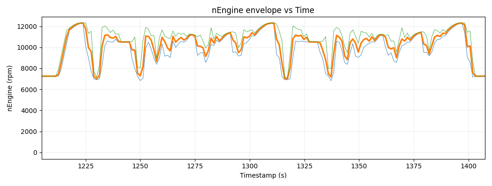
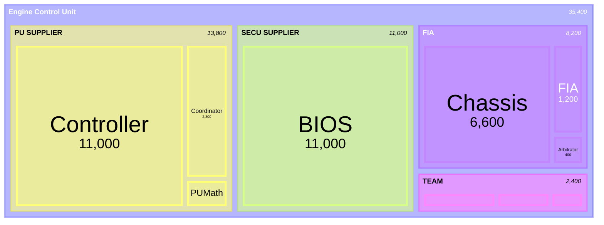
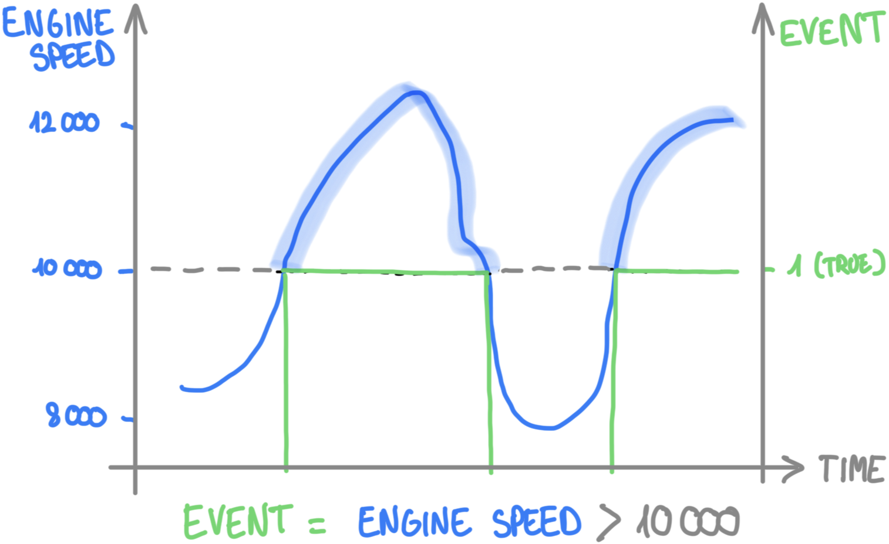
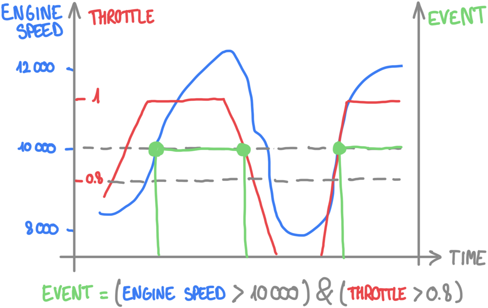
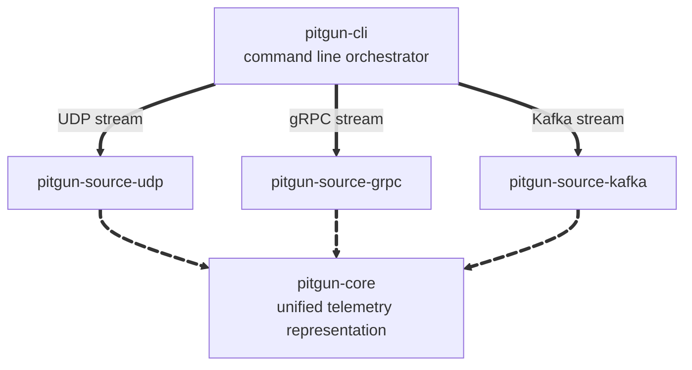
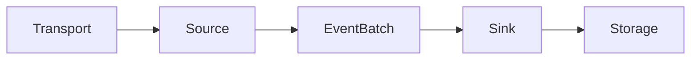
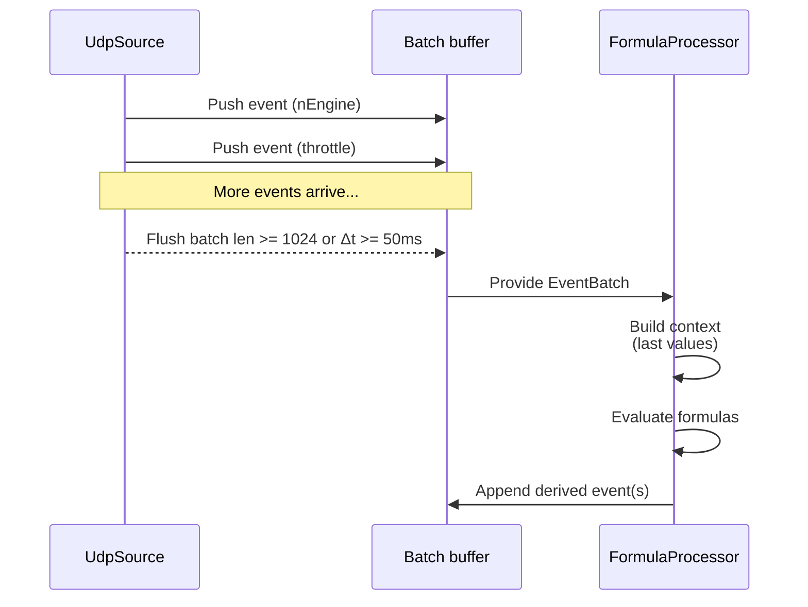
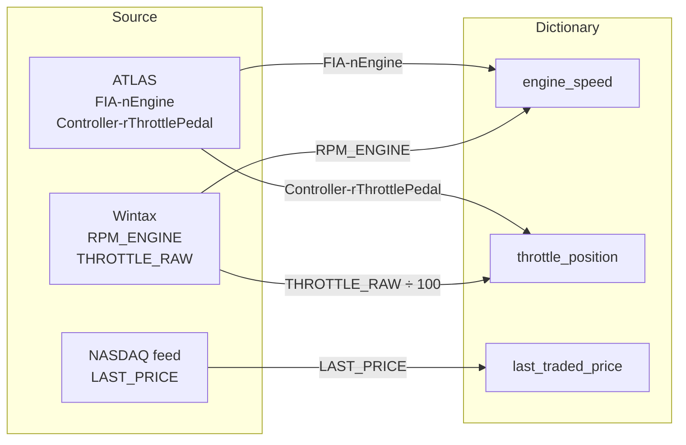

<p align="center">
  <a href="https://pitgun.loicbelec.com">
    
  </a>
</p>

>  This file chronicles the evolution of Pitgun’s design decisions, experiments, and insights.  
> For official documentation, see [index.md](./index.md).

# Development journal

## Introduction

**Pitgun** is my personal journey into building a modular telemetry and data processing framework in Rust. 

The project explores how to ingest, emulate, and analyze high-frequency data streams - similar to those used in Formula 1 telemetry systems - while applying modern Rust concepts and patterns.

### Goals  
- Learn and apply modern Rust in a real-world, performance-critical context  
- Build a modular, low-latency data pipeline  
- Experiment with UDP streaming, parallel ingestion, and high-frequency emulation  
- Bridge **Formula 1 telemetry** with **High-Frequency Trading (HFT)** paradigms - both domains where latency and precision prevail  

This repository is a learning log. I’m documenting not just the code, but the thought process, mistakes, and lessons along the way.  

By combining insights from Formula 1 telemetry and High-Frequency Trading, Pitgun is my sandbox to experiment with ultra-low-latency data systems.

## Table of contents
- [Introduction](#introduction)
- [Project Structure](#project-structure)
- [Roadmap](#roadmap)
- [1 - Emitting data over UDP](#1---emitting-data-over-udp)
- [2 - Concurrent emission](#2---concurrent-emission)
- [3 - Definition of events](#3---definition-of-events)
- [4 - The orchestrator](#4---the-orchestrator)
- [5 - Integration with the core layer](#5---integration-with-the-core-layer)
- [6 - Introducing the pipeline manifest](#6---introducing-the-pipeline-manifest)
- [7 - First computed values](#7---first-computed-values)
- [8 - Declarative formulas](#8---declarative-formulas)
- [9 - Performance baseline](#9---performance-baseline)
- [10 - A story of manifests](#10---a-story-of-manifests)
- [11 - From F1-specific dictionary to a canonical multi-domain telemetry model](#11---from-f1-specific-dictionary-to-a-canonical-multi-domain-telemetry-model)
- [12 – Switching Gemini for Qwen (and back, partially)](#12--switching-gemini-for-qwen-and-back-partially)
- [13 - Segment aggregation (window-by-key)](#13---segment-aggregation-window-by-key)
- [14 - The Distributed Computing Pivot](#14---the-distributed-computing-pivot)

## Project structure
Pitgun is organized as a Rust workspace composed of three main crates:

| Crate | Purpose |
|-------|----------|
| `pitgun-core` | Core library: data structures, parsing, pipeline operators |
| `pitgun-cli` | Command-line interface: ingest, transform, export |
| `pitgun-emulator` | UDP emitter: replays CSV datasets at configurable pace |


## Roadmap

> This roadmap evolves as Pitgun grows.  
> The goal is to transform Pitgun from a simple UDP replay tool into a modular telemetry platform capable of ingesting, transforming, storing, and analyzing real-time and historical data.

### Core engine & workspace
- [x] Create Rust workspace (`pitgun-core`, `pitgun-cli`, `pitgun-emulator`)
- [x] Introduce unified event model (`Event`, `EventBatch`)
- [x] Define core abstractions (`Source → Processor → Sink → Pipeline`)
- [x] Add pipeline manifest (YAML-driven configuration)
- [ ] Internal testing framework for pipeline stages
- [ ] Pipeline DAG builder (for multi-stage formula execution)

### Sources
- [x] UDP Source (live telemetry or replay)
- [ ] gRPC Source (`pitgun-source-grpc`)
- [ ] Kafka Source (`pitgun-source-kafka`)
- [ ] File Source (CSV replay)
- [ ] File Source (Parquet replay)
- [ ] Simulated Source (synthetic channels for testing)

### Sinks
- [x] Console Sink  
- [ ] CSV Sink  
- [ ] Parquet Sink  
- [ ] Arrow / IPC Sink  
- [ ] Kafka Sink  
- [ ] Prometheus metrics exporter  
- [ ] Bolt-based “debug sink” (emit intermediate formula values)

### Processing layer

#### Primitive processors
- [x] Channel filtering  
- [x] Runtime stats (frame count, rate)  
- [x] `ScaleProcessor`  
- [ ] `OffsetProcessor`  
- [ ] `RenameProcessor`  

#### Formula & computation
- [x] JSON AST evaluation path  
- [x] AST → `Expr` internal representation  
- [x] `FormulaProcessor` (evaluate AST per batch)  
- [ ] Dependency extractor (detect required channels)  
- [ ] Evaluation DAG (ordering of expressions)  
- [ ] Window processors (moving averages, FIR/IIR, smoothing)  
- [ ] Event-based gating (`event(t)` → gated formulas)  
- [ ] Multi-stage metrics (chained formulas and intermediates)

#### Quality & safety
- [ ] NaN handling  
- [ ] Bounds checks  
- [ ] Channel presence & fallback logic  
- [ ] Plausibility filters

### Bolt ecosystem

#### Bolt format
- [ ] Bolt manifest definition (`.bolt`)  
- [ ] Bolt loader in `pitgun-cli`  
- [ ] Bolt → `Expr` compilation (grouped ASTs)  
- [ ] Bolt versioning & metadata

#### Bolt bytecode
- [ ] `.boltbc` format (compiled AST)  
- [ ] Bytecode interpreter  
- [ ] Bytecode optimizer (optional)  
- [ ] Local Bolt Repository (`~/.pitgun/bolt/`)  
- [ ] Bytecode cache invalidation & compatibility checks

#### Toolboxes
- [ ] Toolbox structure (collection of bolts)  
- [ ] Toolbox manifest  
- [ ] Toolbox installation logic  
- [ ] Toolbox examples (engine, aero, tyres, …)

### Registry & API

#### Pitgun Registry (`pitgun.io`)
- [ ] Bolt registry API  
- [ ] Toolbox registry API  
- [ ] Search & discovery (by domain, tags, version)  
- [ ] Versioning & semantic releases  
- [ ] Documentation hosting for bolts/toolboxes

#### API / Integration
- [x] LLM API generating JSON AST (Codex → AST)  
- [ ] Endpoint for validating expressions  
- [ ] Endpoint for converting text → bolt manifest  
- [ ] Endpoint for bundling bolts  
- [ ] Registry authentication (tokens, scoped access)

### Platform & integration
- [ ] FFI with Python (via PyO3)  
- [ ] Publish crates on [crates.io](https://crates.io)  
- [ ] Benchmarks and performance profiling  
- [ ] Compare telemetry patterns with HFT (market data feeds, UDP multicast)  
- [ ] GitHub Actions CI (lint, tests, build)  
- [ ] Reproducible examples & demos

### Session & data model
- [ ] Add session context (car, stint, lap)  
- [ ] Timestamp normalization & drift handling  
- [ ] Multi-channel alignment policies (interpolation, forward-fill, zero-fill)  
- [ ] Structured metadata for datasets & replays  
- [ ] Track context (sLap, GPS, sectors)

### Developer experience
- [ ] `pitgun new bolt <name>` scaffold command  
- [ ] `pitgun debug` to inspect batches and channels  
- [ ] Diagnostics & logging improvements  
- [ ] REPL mode for evaluating small AST expressions  
- [ ] Config validator for manifests, bolts, and toolboxes 

## 1 - Emitting data over UDP

### Context

In **Formula 1**, telemetry is both a technological backbone and a closely guarded secret. Every team uses the [Atlas Ecosystem](https://www.motionapplied.com/products/ATLAS), developed by *Motion Applied* (formerly *McLaren Applied*), which provides a complete data acquisition toolchain - from the ECU (Electronic Control Unit) in the car to the dashboard software you see lighting up in the pitlane.

Telemetry is split into several channels. One stream is sent directly to the FIA, which monitors a subset of live telemetry data in real time to enforce sporting and technical regulations. These streams travel through the paddock network using **UDP multicast**, allowing broadcast to multiple recipients - but each flow is **encrypted**, ensuring teams cannot read each other’s data.

### Objective

My first objective is to reproduce a minimalistic version of this system - a first step toward a modular telemetry framework capable of emulating real F1 data flow with synthetic data.

### Implementation

The first channel I picked to emulate is the engine speed, known under the Atlas namespace as `FIA-nEngine`.



Here are the design goals:
- **Data source:** simple CSV time series.
- **Transport:** UDP multicast to mimic trackside broadcast patterns.
- **Encryption:** lightweight XOR-style scrambling (placeholder for proprietary ciphers).
- **Replay pacing:** optional pacing to preserve timing between samples.

The channel name is inferred from a CSV filename, e.g. `FIA-nEngine.csv` → channel `FIA-nEngine`. Each row in the CSV is replayed over UDP: by default as fast as possible, or paced with `--pace` to reproduce real sample intervals based on the `Timestamp` column.

#### Example dataset
```csv
Timestamp,ChannelValue
62076104000000,12034.5
62076105000000,12035.2
```

#### Command-line flags

| Flag | Type | Default | Description |
|:-----|:------|:---------|:-------------|
| `--target <HOST:PORT>` | `String` | *(required)* | Target address, e.g. `239.10.0.1:5001` for multicast or `127.0.0.1:5001` for unicast. |
| `--csv <PATH>` | `Path` | *(required)* | Path to the input CSV file (with headers `Timestamp,ChannelValue`). |
| `--pace` | `bool` | `false` | Respect CSV timing (pacing based on timestamp deltas). If not set, the file is replayed as fast as possible. |
| `--channel <STRING>` | `Option<String>` | *(default = filename stem)* | Override the default channel name derived from the CSV filename. |
| `--mcast-ttl <u32>` | `1` | Time-to-Live value for multicast packets. Ignored for unicast targets. |

#### Example usage

```bash
pitgun-emulator \
  --target 239.10.0.1:5001 \
  --csv datasets/telemetry/FIA-nEngine.csv \
  --pace
```

### Pitgun UDP packet
Each telemetry frame emitted by the emulator is encoded into a compact binary structure designed for low-latency transmission over UDP.

The layout prioritizes simplicity and deterministic parsing - no headers, padding, or delimiters beyond what’s strictly necessary.


channel    = "FIA-nEngine"
ts_csv_ns  = 62076104000000
value      = 1234.5
```

the serialized bytes look like this:

```
╔════════════════════════════════════════════════════════════════════════╗
║  Field             │ Bytes (hex)                                       ║
╟────────────────────┼───────────────────────────────────────────────────╢
║ len_channel (11)   │ 0B 00                                             ║
║ "FIA-nEngine"      │ 46 49 41 3A 6E 45 6E 67 69 6E 65                  ║
║ ts_csv_ns          │ 00 C0 5F 73 63 00 00 00 00 00 00 00 00 00 00 00   ║
║ value (1234.5)     │ 00 00 00 00 00 49 93 40                           ║
╚════════════════════════════════════════════════════════════════════════╝
```

*(All fields use **little-endian** encoding to align with Rust’s native layout on x86 platforms.)*

#### Reference implementation

```rust
/// Binary frame layout:
/// [len_channel: u16][channel][ts_csv_ns: u128 LE][value: f64 LE]
fn encode_frame(channel: &str, ts_csv_ns: u128, value: f64) -> Vec<u8> {
    let name = channel.as_bytes();
    let mut buf = Vec::with_capacity(2 + name.len() + 16 + 8);
    let len = u16::try_from(name.len()).unwrap_or(u16::MAX);
    buf.extend_from_slice(&len.to_le_bytes());
    buf.extend_from_slice(name);
    buf.extend_from_slice(&ts_csv_ns.to_le_bytes());
    buf.extend_from_slice(&value.to_le_bytes());
    buf
}
```

#### Notes
- The frame is **self-delimiting**: the first two bytes define the length of the channel name.  
- No CRC or sequence number is included - Pitgun assumes reliable transmission within local or simulated networks.  
- This layout is minimal by design: easy to deserialize, endian-safe, and ideal for high-frequency telemetry streams.

### Architecture notes

The emulator follows a layered architecture that mirrors a real telemetry stack.  
Data first flows from CSV ingestion, where raw samples are read and timestamped, into a processing layer that handles pacing, frame encoding, and optional cryptographic operations. The resulting binary frames are then transmitted over UDP, completing the transport stage.  

Each input file represents an independent telemetry channel - for example, `FIA-nEngine` or `Arbitrator-rThrottlePedal` - allowing multiple streams to coexist and simulate distributed sensors.  

The network layer aims for realism: it supports multicast group joins, dynamic packet sizing, and a low-latency send path to emulate real-time behavior. A lightweight security stub is also included, providing a pluggable crypto module so that the current XOR cipher can later be replaced by stronger encryption schemes without changing the framing logic.

### What’s next?

- Extend to multi-channel replay with parallel workers.
- Build a receiver tool to monitor packet loss and latency.
- Define a versioned binary format for future compatibility.
- Add session context (car, stint, lap) and synchronize timestamps.

## 2 - Concurrent emission

### Context

This treemap illustrates the internal structure of the Formula 1 Engine Control Unit (ECU) based on telemetry channel volume.
Each block represents a logical subsystem within the ECU - from real-time control loops to data logging and chassis coordination.

The Controller and TAG320BIOS dominate, handling nearly half of all runtime signals: the former executes the ECU scheduler and control logic, while the latter manages low-level logging, BIOS states, and diagnostic coverage. Around them, the Chassis, Coordinator, and BrakeControl modules form the backbone of vehicle dynamics and safety. Finally, smaller application layers such as Dash and regulatory interfaces like FIA complete the overall architecture.

Together, these components show how a modern F1 ECU combines control, orchestration, and observability into a single embedded platform.



The ECU exposes tens of thousands of channels. Many are **low-frequency “slow raw”** signals, but a critical subset runs at **high frequency** (e.g., engine speed). To get closer to real track conditions, we now emit multiple high-frequency channels in parallel.

Alongside the engine speed, we introduce the throttle pedal amplitude: `rThrottlePedal`. The goal is to simulate at least two high-frequency streams over UDP with realistic pacing and clean separation by channel.

### Objective

My objective is to emit **2 high-frequency channels** (e.g., `nEngine`, `rThrottlePedal`) from CSVs.

I will maintain the minimal wire format from the first chapter:
```
[len_channel:u16][channel][ts_csv_ns:u128 LE][value:f64 LE]
```

### Implementation

#### K-Way merge for telemetry streams

The [k-way merge](https://en.wikipedia.org/wiki/K-way_merge_algorithm) is a classic algorithmic pattern used to merge several already-sorted input streams into a single globally-sorted output stream. Here, k denotes the number of channels (CSV files) being merged.

Each telemetry file in Pitgun - for example `FIA-nEngine.csv`, `Arbitrator-rThrottlePedal.csv`, or `Chassis-NGear.csv` - is sorted by timestamp.
The emulator opens one cursor per file, each cursor holding the next unread row.
At every iteration, it picks the cursor with the **smallest pending timestamp**, emits that sample, and then advances only that cursor.

This produces a monotonically increasing global timeline across all channels:

```mermaid
timeline
    ts = 653 004 000 : nEngine = 0
        : rThrottlePedal = 0.6
    ts = 654 004 000 : nEngine = 0
    ts = X : nEngine = Y
    ts = 662 004 000 : nEngine = 0
    ts = 663 004 000 : nEngine = 0
        : rThrottlePedal = 0.6
````

Algorithmically, this behaves like the merge step in a multi-way mergesort and runs in $O(N*log(k))$ time with $O(k)$ memory. It is an essential pattern for real-time telemetry replay, ensuring deterministic ordering and synchronized pacing across multiple sensor or ECU channels.

#### Unicast vs multicast networking modes

The emulator supports both unicast and multicast UDP transmission, which define who receives the datagrams.

##### Unicast - Point-to-Point

*“Send to one specific host.”*

The target is a regular IPv4 address, such as `127.0.0.1:5001` or `192.168.1.42:5001`. Packets are delivered to exactly one receiver. This mode is ideal for local testing or one-to-one communication between the emulator and a single analysis tool.

##### Multicast - One-to-Many

*“Broadcast to everyone listening on a group address.”*

The target lies in the multicast address range `224.0.0.0` - `239.255.255.255`, for example `239.10.0.1:5001`. Any host that has joined this multicast group will receive the same packets simultaneously. This is the standard model for motorsport telemetry distribution where multiple engineering clients subscribe to identical real-time feeds (strategy, power-unit, simulation etc.).

In Pitgun, the socket layer automatically detects whether the destination is multicast (first octet 224–239) and adjusts its configuration: `set_multicast_ttl_v4(ttl)` and `set_multicast_loop_v4(false)` ensure proper propagation and prevent echoing packets back to the sender.

#### Example usage

```bash
pitgun-emulator \
  --target 239.10.0.1:5001 \
  --input nEngine=datasets/telemetry/RUN-001/FIA-nEngine.csv \
  --input throttle=datasets/telemetry/RUN-001/Controller-rThrottleR.csv \
  --pace
```

#### Reference implementation

The following code shows the core of Pitgun’s multi-channel telemetry replay loop. Each input CSV represents an independent telemetry stream. The loop maintains one cursor per channel, performs a k-way merge based on timestamps, and emits synchronized frames in real time over UDP.

```rust
// --- Reference implementation: multi-channel replay loop ---
let mut cursors = open_all_channels(args.input)?;
let t0_ns = cursors
    .iter()
    .filter_map(|c| c.next.as_ref().map(|r| r.ts))
    .min()
    .expect("no data");
let start = Instant::now();

loop {
    // Pick the next record globally (k-way merge)
    let Some(i) = cursors
        .iter()
        .enumerate()
        .filter_map(|(i, c)| c.next.as_ref().map(|r| (i, r.ts)))
        .min_by_key(|(_, ts)| *ts)
        .map(|(i, _)| i)
    else { break };

    let (channel, ts, val) = {
        let c = &mut cursors[i];
        let row = c.next.take().unwrap();
        (c.channel.clone(), row.ts, row.val)
    };

    // Optional pacing: wait until real time catches up
    if args.pace {
        let delay = Duration::from_nanos((ts - t0_ns) as u64);
        if let Some(rem) = delay.checked_sub(start.elapsed()) {
            std::thread::sleep(rem);
        }
    }

    // Encode and emit the frame
    let frame = encode_frame(&channel, ts, val);
    sock.send(&frame)?;

    // Advance this channel
    cursors[i].next = cursors[i].it.next().transpose()?;
}
```

This minimal loop encapsulates Pitgun’s design principles: concurrency through independent cursors, deterministic ordering through k-way merging, and controlled real-time pacing for accurate telemetry replay.

### Architecture notes

The current version of Pitgun introduces a clear and modular architecture.
Each component has a focused role. The core handles data and timing logic, while dedicated adapters (`pitgun-source`, `pitgun-sink`) deal with I/O like UDP, gRPC, or Parquet.
This separation makes it easy to extend the system later without rewriting the core.

The replay engine itself is deterministic: it merges multiple telemetry channels using a k-way merge, ensuring that data from all sensors is emitted in correct chronological order.
Timing accuracy is preserved, and the optional pacing mode reproduces real-time playback.

Memory usage stays low since only one row per channel is buffered, which scales well even when replaying many channels at once.
The result is a lightweight and predictable system that behaves like a real telemetry feed.

With this foundation, Pitgun now moves from a simple file replayer toward a full telemetry platform  capable of streaming, recording, and analyzing data consistently across different environments.

## 3 - Definition of events

> This chapter is intentionally more theoretical than the rest of the journal.
I wrote it to clarify for myself how telemetry signals behave, how automotive/F1 ECUs emit data, and why an event-based mental model is essential for building Pitgun.

### Context

Before diving into channel processing, it is essential to introduce the concept of events. An event is a **logical condition applied to one or more channels** and is widely used in motorsport to compute metrics within specific operating contexts.

A context describes the situation the car is in. For example, *the car is entering the pitlane*. We can express this as a condition on a spatial signal:

$$
s_{\mathrm{Pitlane}}(t) > 0
$$

In that context, *the engine speed within the pitlane* is then interpreted as:

$$
n_{\mathrm{Engine}}\big(s_{\mathrm{Pitlane}}\big)
$$

#### Applications of event-gated data

Event gating lets you analyze signals only within relevant operational windows. Typical applications include:

- **Energy management** - isolating power flows between battery, MGUs (kinetic/thermal), and ICE.  
- **Component wear / damage estimation** - assessing stress or fatigue under specific loads.  
- **Performance analysis** - comparing driver inputs during accel/brake/lift phases.  
- **Calibration validation** - monitoring control parameters in defined modes (pit limiter, safety car, full-load).  
- **Thermal management** - gating by coolant/oil temperature windows.  
- **Fuel consumption modeling** - gating steady-state cruise vs. transient.  

> Just a reminder to add other use cases...

#### Practical considerations

Channels often differ in sampling rate and latency, so you must **align** them when applying events. Two common strategies:

1) **Direct gating (no interpolation)**  
   Use only samples that fall inside active event intervals → maximizes temporal fidelity, data may be sparse.

2) **Interpolated/resampled gating**  
   Interpolate or resample channels so the event mask and signals align on a common grid → maximizes continuity, introduces interpolation assumptions.

| Strategy            | Pros                               | Cons                              |
|---------------------|------------------------------------|-----------------------------------|
| Direct gating       | Exact timestamps; no assumptions   | Irregular samples; gaps possible  |
| Interp./resampled   | Smooth, aligned arrays for metrics | Interpolation bias/phase risks    |

### Mathematical definition
The following section presents the mathematical derivation and formal definition of events in the Pitgun framework. This theoretical groundwork serves to ensure consistency, traceability, and extensibility across all modules that depend on event-driven logic. Since events are a fundamental abstraction in Pitgun, a clear formalization is essential to guarantee robustness in future implementations.

#### Channels

Let a set of channels

$$
\mathcal{C} = \{ C_1, C_2, \dots, C_n \}
$$

where each channel $C_i : \mathbb{R} \to \mathbb{R}$ is a function of time $t$ (sampled in practice).

**Examples:**

$$
C_1(t) = n_\text{Engine}(t), \quad
C_2(t) = v_\text{Car}(t), \quad
C_3(t) = R_\text{Throttle}(t)
$$

#### Predicate or condition

A predicate is a logical expression applied to one or more channels:

$$
\varphi : \mathbb{R}^n \to \lbrace \mathrm{True}, \mathrm{False} \rbrace
$$

**Examples:**

$$
\begin{aligned}
\varphi_1(x_1,x_2) &: x_1 > 12000 \quad &&\text{(high engine speed)} \\
\varphi_2(x_1,x_2) &: x_2 < 50 \quad &&\text{(vehicle speed below 50 km/h)} \\
\varphi_3(x_1,x_2,x_3) &: (x_1 > 9000) \land (x_3 > 0.8) \quad &&\text{(high revs AND high throttle)}
\end{aligned}
$$

#### Elementary Event

An elementary event associated with a predicate $φ$ is the Boolean signal:

$$
E_\varphi(t) =
\begin{cases}
1 & \text{if } \varphi(C_1(t), C_2(t), \dots, C_n(t)) \text{ is true},\\
0 & \text{otherwise.}
\end{cases}
$$

Compact notation:

$$
E_\varphi(t) = \mathbf{1}\{\varphi(\mathbf{C}(t))\}
$$

Hence, $E_\varphi : \mathbb{R} \to \{0,1\}$ is a Boolean time series.

#### Edges and active intervals

Define the **rising** and **falling** edges of $E_\varphi(t)$:

$$
\begin{aligned}
t_i^{\uparrow} &= \{ t \mid E_\varphi(t^-) = 0, \; E_\varphi(t^+) = 1 \}, \\
t_i^{\downarrow} &= \{ t \mid E_\varphi(t^-) = 1, \; E_\varphi(t^+) = 0 \}.
\end{aligned}
$$

Each pair $[t_i^{↑}, t_i^{↓})$ defines a time segment during which the event is active:

$$
\mathcal{S}_\varphi = \bigcup_i [t_i^{\uparrow},\, t_i^{\downarrow})
$$

#### Duration and frequency

- **Total active duration**

$$
T_\varphi = \sum_i (t_i^{\downarrow} - t_i^{\uparrow})
$$

- **Number of occurrences**

$$
N_\varphi = |\mathcal{S}_\varphi|
$$

- **Duty ratio (occupancy)**

$$
\rho_\varphi = \frac{T_\varphi}{T_\text{total}}
$$

#### Composite Events

Events can be **combined** with logical operators:

$$
\begin{aligned}
E_{\varphi_1 \land \varphi_2}(t) &= E_{\varphi_1}(t) \cdot E_{\varphi_2}(t) \\
E_{\varphi_1 \lor \varphi_2}(t) &= \max(E_{\varphi_1}(t), E_{\varphi_2}(t)) \\
E_{\neg \varphi_1}(t) &= 1 - E_{\varphi_1}(t)
\end{aligned}
$$

These operations allow composite rules, such as *“high rpm AND high throttle”*, *“boost AND brake”*, etc.

#### Example

Let

$$
\varphi_1: n_\text{Engine} > 10000, \qquad
\varphi_2: T_\text{Throttle} > 0.8
$$

Then

$$
E_{\varphi_1}(t) = \mathbf{1}\{ n_\text{Engine}(t) > 10000 \}, \quad
E_{\varphi_2}(t) = \mathbf{1}\{ T_\text{Throttle}(t) > 0.8 \}
$$

And

$$
E_\text{PowerRun}(t) = E_{\varphi_1}(t) \land E_{\varphi_2}(t)
$$

The active intervals correspond to periods with *"high engine speed AND high load"*.

### Pratical use cases

Consider a simple use case: the event is triggered when the engine speed rises above *10,000 rpm*. The corresponding Boolean signal takes the value true during this period. When this condition is combined with a throttle ratio *exceeding 0.8*, the resulting event is illustrated in the graph on the right.

| Simple event | Combined conditions |
|:-------------:|:-------------------:|
|  |  |

Obtaining such an event unlocks many possibilities for advanced data processing and physical interpretation.

From a thermodynamic or energy-management perspective, isolating time intervals where specific operating conditions occur enables you to quantify the power flow and energy exchange between the Power Unit components. This is essential when analyzing how mechanical, electrical, and thermal subsystems interact during high-load phases of the lap.

Depending on the working hypothesis, several approaches can be adopted. If your goal is to map these events spatially, you can project them along the circuit’s curvilinear abscissa ($sLap$). This requires a reliable positional reference, typically derived from GPS, distance sensors, or integrated wheel-speed estimation.

Alternatively, you can infer the vehicle’s “position state” dynamically from physical observables such as lateral acceleration, steering angle, or gear selection, which correlate with specific track segments. This indirect inference becomes particularly useful when GPS telemetry is noisy, incomplete, or unavailable.

In both cases, the key insight is that an event acts as a temporal mask applied to raw telemetry, allowing focused analysis of energy balance, transient behavior, or efficiency metrics within targeted operating windows.

## 4 - The orchestrator

### Context

`pitgun-cli` is the central orchestrator of the Pitgun ecosystem. It acts as the bridge between the future different crates, providing a unified interface for engineers to observe, validate, and manipulate telemetry streams in real time.

### Objective

Initially designed as a lightweight receiver for UDP frames, `pitgun-cli` will evolve into a full-featured command-line toolkit capable of interfacing with any transport supported by the platform whether UDP, gRPC, or later Kafka. It ensures interoperability between the emulator, the stream server, and future sinks such as Parquet.


#### Core responsibilities

`pitgun-cli` plays several key roles in the Pitgun architecture:

1.	**Unified telemetry subscriber :** It can subscribe to telemetry data over multiple protocols (UDP, gRPC, Kafka) and decode it into structured telemetry events shared across the project (Event, EventBatch from `pitgun-core`).
2.	**Monitoring and Diagnostics :** The CLI continuously reports throughput, packet rate, channel statistics, gaps, and basic latency metrics acting as a real-time probe of system health. This makes it ideal for testing new transports, debugging network issues, or validating encoder/decoder consistency.
3.	**Recording and Replay Support :** It can optionally record incoming telemetry into CSV or Parquet files, allowing reproducible analysis and offline comparison with other runs.
4.	**Protocol-Oriented Abstraction Layer :** Instead of embedding logic directly, Pitgun CLI delegates low-level work to specialized crates:
    - `pitgun-source-udp` for UDP reception
    - `pitgun-source-grpc` for gRPC subscriptions
    - ``pitgun-core`` for decoding and normalization
5.	**Human-Readable Frontend :** It provides formatted output modes, making telemetry analysis and data visualization straightforward even without external tools.

#### Example usage

##### Listening to UDP telemetry

```bash
pitgun-cli \
  -- subscribe \
  --bind 127.0.0.1:5001 \
  --json
```

This mode receives frames directly from `pitgun-emulator` or any compatible UDP emitter. Each frame is decoded using Pitgun’s wire format `([len:u16][channel][ts:u128][value:f64])` and converted into structured telemetry events.

##### Subscribing to gRPC telemetry

```bash
pitgun-cli \
  -- subscribe \
  --grpc-endpoint http://127.0.0.1:50051 \
  --stats-interval 1
```

In this configuration, the CLI connects to pitgun-streamd, the gRPC broker that relays telemetry batches published from UDP or other sources. The CLI treats both sources (UDP and gRPC) uniformly, using the same internal model and statistics engine.

 ### Architecture notes

 At runtime, `pitgun-cli` instantiates a source adapter according to the selected transport:



This abstraction allows the CLI to remain consistent regardless of the input source, ensuring that downstream sinks (CSV, Parquet) can consume data without caring about the transport layer.


## 5 - Integration with the core layer

`ptigun-core` is the backbone of the whole Pitgun ecosystem. It defines the shared data model and streaming contracts that every crate: CLI, emulator, or stream server relies on to communicate consistently. Through its generic interfaces, it abstracts the mechanics of telemetry transport, so that the logic of reading, decoding, and recording data can evolve independently.

At runtime, `pitgun-cli` doesn’t manipulate UDP packets or files directly. Instead, it instantiates a `Source` and a set of `Sinks` defined in `pitgun-core`.
This separation ensures that the orchestration logic in the CLI remains transport-agnostic. The same code can read telemetry from UDP, gRPC, Kafka, or even a file replay and feed the same downstream processing pipeline.

### The core as a shared semantic layers

The `pitgun-core` crate defines two fundamental abstractions:
- Source - a trait representing any telemetry provider (UDP socket, gRPC stream, Kafka consumer, CSV reader, etc.).
- Sink - a trait representing any consumer of processed events (CSV writer, Parquet exporter, metrics publisher, etc.).

Together, they form a simple pattern:


Each piece of the Pitgun ecosystem simply plugs into this flow by implementing one of these traits.

The shared data structures (Event, EventBatch, SessionMeta, Quality) provide a universal language between all components.
No matter the transport, every telemetry point is represented with the same timestamped event model.

## 6 - Introducing the pipeline manifest
### Context

As Pitgun grows from a simple UDP replayer into a modular telemetry platform, one architectural requirement becomes increasingly important: the ability to reconfigure the runtime without recompiling the code.

Until now, pitgun-cli wired its pipeline directly in Rust:

```
UdpSource → ChannelFilterProcessor → StatsProcessor → ConsoleSink
```

This was fine for early prototyping, but not scalable as the number of processors, sinks, and protocols increases (filtering, CSV sinks, bundle processors, gRPC, Kafka…).

Pitgun now supports a **YAML-driven pipeline manifest**, allowing declarative configuration of runtime behavior.

### Objective

The goal is simple: introduce a minimal YAML pipeline manifest that configures the source, processors, and sink without touching pitgun-core and without breaking the existing CLI behavior.

This turns Pitgun into a real, configurable data pipeline instead of a hard-coded test harness.

### Implementation
#### YAML manifest

The manifest lives in `pitgun-cli` under `manifest.rs` and is deserialized using `serde_yaml`.

The minimal schema currently supports:
- source selection (UDP: bind address, port)
- processors (channel filtering, statistics)
- sink (console output)

Template example:
```yaml
source:
  type: udp
  bind_addr: "0.0.0.0"
  port: 5000

processors:
  - type: channel_filter
    channels: ["nEngine", "throttle"]
  - type: stats

sink:
  type: console
```

Thanks to this manifest, the CLI can now construct the entire pipeline dynamically. The internal Rust wiring becomes something the user controls externally, like a configuration file in *OpenTelemetry Collector* or *Datadog Agent YAML*.

#### Exemple usage

A key design constraint was non-disruptive evolution:
Pitgun must behave exactly as before if no manifest is provided.

This is now the case:

- If the user runs:
```bash
pitgun-cli subscribe
```
The original hard-coded UDP pipeline is used.

- If the user provides:
```bash
pitgun-cli subscribe --config manifests/dummy-pitgun.yaml
```
The pipeline is entirely assembled from the YAML file.
This runs a filtered + statted pipeline derived entirely from YAML.

The console again prints high-frequency events from `nEngine` and `throttle`, with the StatsProcessor reporting rates at periodic intervals (depending on its internal threshold).

> A new `manifests/` folder was created to store example pipelines.

### Architecture notes

This addition clarifies an important architectural boundary:
- `pitgun-core` remains the runtime engine
(Source, Processor, Sink, Pipeline, UdpSource, StatsProcessor, etc.)
- `pitgun-cli` becomes the orchestrator, responsible for:
    - loading manifests
    - instantiating processors
    - connecting sources and sinks
    - managing runtime behavior

By keeping all manifest logic inside the CLI, the core stays clean, generic, and portable.
This separation mirrors patterns found in modern streaming systems: `Collector` vs `Engine`, `Controller` vs `Runtime`.

### What this unlocks

The pipeline manifest iss a structural milestone.

It sets the stage for:
- Bundle manifests (inputs, derived metrics, formula evaluation)
- Source profiles (ECU v3/v4 channel definitions)
- Advanced processors (smoothing, windowing, quality filters)
- Multi-sink pipelines (console + CSV + Parquet + gRPC)
- Test harnesses with reproducible declarative setups
- Complex telemetry sessions without recompilation

Pitgun now moves decisively from a prototype toward a real telemetry processing engine.

## 7 - First computed values
### Context
At this stage, Pitgun can ingest UDP telemetry, decode the incoming frames into structured values, and route them through the early pipeline stages (filtering, statistics). The full Event/EventBatch model is not implemented yet, but the pipeline is now stable enough to support the next step: actual data transformation.

This chapter introduces the first experiment in modifying the data stream inside the pipeline. The goal is intentionally modest: validate that the processing layer can detect selected channels, update their values, and propagate the modified results downstream.

### Objective

Many future features depend on Pitgun’s ability to transform raw telemetry into richer signals:
- `omega_engine = rpm * 2π/60`
- `power_engine = torque * omega`
- `windowed moving averages`
- `plausibility or quality checks`

All of these require a pipeline capable of changing the data, not just forwarding it. Before introducing expressions, windows, dependencies, or units, the processing layer must prove it can perform even the simplest mutation. This chapter acts as that milestone: confirming that Pitgun can alter the data stream in flight.

### Implementation of ScaleProcessor

A minimal processor provides the smallest possible test of mutation:
```
value' = value * factor
```
It targets one channel, applies a constant multiplier, and outputs the updated value. This is the groundwork for more complex processors-derived metrics.

#### Extending the manifest

To keep the system declarative, the new processor is exposed through the pipeline manifest.

A new processor type is added:
```yaml
processors:
  - type: scale
    channel: "nEngine"
    factor: 2.0
```

This describes a simple rule:
- select the channel called nEngine
- multiply its value by 2.0
- forward the updated sample to the next stage

No additional syntax or DSL is required at this point; the manifest simply instructs the CLI how to assemble the pipeline.

To support this, the *ProcessorConfig* structure gains two optional fields:
```rust
pub struct ProcessorConfig {
    pub r#type: String,
    pub channels: Option<Vec<String>>,
    pub channel: Option<String>,
    pub factor: Option<f64>,
}
```

This keeps the configuration minimal while leaving room for more advanced processors later.

#### Reference implementation

The processor itself follows the same pattern as the existing ones: a *struct* holding its configuration, and a process method mutating the incoming batch.
```rust
pub struct ScaleProcessor {
    channel: String,
    factor: f64,
}

impl ScaleProcessor {
    pub fn new(channel: String, factor: f64) -> Self {
        Self { channel, factor }
    }
}

impl Processor for ScaleProcessor {
    fn process(&mut self, batch: &mut EventBatch) {
        for event in &mut batch.events {
            if event.channel == self.channel {
                event.value *= self.factor;
            }
        }
    }
}
```

#### Example usage
With the processor enabled in the manifest, nEngine samples are transformed on the fly.

For example:

Before:
```json
{"channel":"nEngine", "value":3500}
```
After scale:
```json
{"channel":"nEngine", "value":7000}
```

Everything else in the batch remains untouched. Filtering, stats, and sinks continue to operate normally.

The CLI builds the processor from the manifest, validating required fields before wiring:
```rust
match processor_cfg.r#type.as_str() {
    "scale" => {
        let channel = processor_cfg.channel.clone().unwrap_or_else(|| {
            eprintln!("scale processor requires 'channel'");
            std::process::exit(1);
        });
        let factor = processor_cfg.factor.unwrap_or_else(|| {
            eprintln!("scale processor requires 'factor'");
            std::process::exit(1);
        });
        processors.push(Box::new(ScaleProcessor::new(channel, factor)));
    }
    // ...
}
```

This small transformation demonstrates that:
1) processors can identify the channels they care about
2) they can mutate values without breaking the flow
3) the manifest can drive computation declaratively
4) the pipeline correctly forwards modified data

### Foundation for future computation

Although trivial, this processor is an important step.
It validates the mechanisms that will later support:
- multi-step formulas
- dependencies between channels
- temporal windows
- units and conversions
- plausibility constraints
- derived metrics defined in bundle manifests

`ScaleProcessor` confirms that Pitgun’s pipeline is ready for the next chapter: a proper `BundleProcessor`, capable of evaluating more expressive operations and producing new signals from the raw telemetry stream.

## 8 - Declarative formulas

### Context
This chapter describes `FormulaProcessor` in its first version v1, the initial, batch-based deterministic formula engine. The `FormulaProcessor` is wired through the manifest → CLI → runtime path. It evaluates JSON AST files to emit derived channels (e.g., `omega_engine`) alongside raw telemetry. The implementation favors determinism and simplicity to stay within F1-style latency budgets.

### What works today
- **Manifest-driven**: `type: formula`, `output: "<channel>"`, `ast: "<json path>"` (e.g., `manifests/omega_engine.json`).
- **Supported ops**: literals, variables, unary negation, binary `+ - * /`, and functions `sin, cos, tan, sqrt, exp, ln, log10, abs, pow`.
- **Dependency detection**: required channel names are extracted from the AST; if any are missing in a batch, the formula is skipped.
- **Evaluation model**: one evaluation per batch, using the *last* value seen per required channel inside that batch; timestamp = max timestamp in the batch.
- **Sink**: in manifest mode, only `console` is supported. CSV recording exists only via CLI flags in non-manifest mode.

### Design principles

The `FormulaProcessor` v1 is designed with a small set of constraints inspired by real-time F1 telemetry and HFT engines. Each decision favors predictability and latency over convenience or expressiveness:

- **Determinism over convenience** – every evaluation path is explicit and stable; no hidden default values or implicit state.
- **No hidden global state** – formulas only see the channels present in the current batch; there is no cross-batch memory or mutable global cache.
- **Zero ambiguity in configuration** – JSON AST files and manifest entries fully describe what is computed; there is no inline DSL or auto-inference.
- **Latency-first execution** – evaluation avoids allocations and dynamic dispatch on the hot path, keeping the engine compatible with strict real-time budgets.

#### Minimal implementation excerpt
```rust
pub struct FormulaProcessor {
    output: String,
    expr: Expr,
    deps: Vec<String>,
}

impl FormulaProcessor {
    pub fn new(output: String, expr: Expr) -> Self {
        let mut deps = HashSet::new();
        collect_vars(&expr, &mut deps); // gather required channel names
        Self { output, expr, deps: deps.into_iter().collect() }
    }

    fn context_from_batch(&self, batch: &EventBatch) -> (HashMap<String, f64>, Option<u64>) {
        let mut values = HashMap::new();
        let mut ts_max: Option<u64> = None;
        for event in &batch.events {
            if self.deps.is_empty() || self.deps.contains(&event.channel) {
                values.insert(event.channel.clone(), event.value); // last value wins
            }
            ts_max = Some(ts_max.map_or(event.ts_ns, |cur| cur.max(event.ts_ns)));
        }
        (values, ts_max)
    }
}

impl Processor for FormulaProcessor {
    fn process(&mut self, batch: &mut EventBatch) {
        if batch.events.is_empty() {
            return;
        }
        let (values, ts_max) = self.context_from_batch(batch);
        if !self.deps.is_empty() && !self.deps.iter().all(|d| values.contains_key(d)) {
            return; // skip if required inputs are missing
        }
        let value = eval_expr(&self.expr, &EvalContext { values: &values });
        let ts_ns = ts_max.unwrap_or(0);
        batch.events.push(Event { channel: self.output.clone(), ts_ns, value });
    }
}
```

### v1 evaluation semantics

`FormulaProcessor` v1 exposes a clear evaluation contract:

- **One evaluation per batch**: each formula is evaluated at most once per incoming `EventBatch`.
- **Last value wins**: when multiple samples of the same input channel appear in a batch, the context uses the last one in chronological order.
- **Derived timestamp = max timestamp**: the derived event uses the maximum `ts_ns` observed in the batch, preserving temporal alignment.
- **Skip on missing dependencies**: if any required input channel is absent from the batch, the formula is skipped and no derived event is emitted.
- **No cross-batch memory**: the context is rebuilt from scratch for each batch; there is no rolling state between batches.
- **One output event per derived channel**: each configured formula appends exactly one derived event (or zero if skipped) to the batch.

These semantics intentionally keep v1 simple, predictable, and easy to reason about under tight latency constraints.

### Evaluation flow diagrams

#### Evaluation flow


#### Batching and evaluation timeline



### Manifest examples
Below are several manifest configurations representative of common patterns used in Formula 1 telemetry pipelines.

#### Engine speed in rad/s
This formula converts engine speed from revolutions per minute (rpm) to angular velocity in radians per second, a standard physical unit for rotational systems.

**Math formula**
$$
\omega = 2 \pi \cdot n / 60
$$

**AST JSON**
```yaml
{
  "type": "binary_op",
  "op": "/",
  "left": {
    "type": "binary_op",
    "op": "*",
    "left": {
      "type": "binary_op",
      "op": "*",
      "left": { "type": "literal", "value": 2.0 },
      "right": { "type": "literal", "value": 3.141592653589793 }
    },
    "right": {
      "type": "var",
      "name": "nEngine"
    }
  },
  "right": {
    "type": "literal",
    "value": 60.0
  }
}
```
**Dependencies:** ["nEngine"]

#### Aerodynamic lift coefficient
This computes the aerodynamic lift coefficient based on measured lift force, air density, velocity, and reference area, normalizing the physical forces into a dimensionless metric.

**Math formula**
$$
C_L = \frac{\text{Lift}}{0.5 \, \rho \, v^2 \, S}
$$

**AST JSON**
```json
{
  "type": "binary_op",
  "op": "/",
  "left": { "type": "var", "name": "Lift" },
  "right": {
    "type": "binary_op",
    "op": "*",
    "left": {
      "type": "binary_op",
      "op": "*",
      "left": {
        "type": "binary_op",
        "op": "*",
        "left": { "type": "literal", "value": 0.5 },
        "right": { "type": "var", "name": "rho" }
      },
      "right": {
        "type": "call",
        "fn": "pow",
        "args": [
          { "type": "var", "name": "v" },
          { "type": "literal", "value": 2.0 }
        ]
      }
    },
    "right": {
      "type": "var",
      "name": "S"
    }
  }
}
```
**Dependencies:** ["Lift", "rho", "v", "S"]

#### Normalized longitudinal acceleration
This expresses longitudinal acceleration as a normalized value by dividing by gravitational acceleration, making it easier to compare load levels across different conditions.

**Math formula**
$$
\mathrm{norm}_{\mathrm{acc}} = \frac{\lvert a_x \rvert}{g \cdot 1.5}
$$

**AST JSON**
```json
{
  "type": "binary_op",
  "op": "/",
  "left": {
    "type": "call",
    "fn": "abs",
    "args": [
      { "type": "var", "name": "ax" }
    ]
  },
  "right": {
    "type": "binary_op",
    "op": "*",
    "left": { "type": "var", "name": "g" },
    "right": { "type": "literal", "value": 1.5 }
  }
}
```
**Dependencies:** ["ax", "g"]

#### Trig + log combination
This derived metric combines steering angle dynamics and the logarithmic response of speed, highlighting situations where small changes in speed have amplified analytical significance.

**Math formula**
$$
\text{weird}_{\text{metric}}
    = \sin(\text{steer}_{\text{angle}})
    \cdot \ln(\text{speed} + 1)
$$

**AST JSON**
```json
{
  "type": "binary_op",
  "op": "*",
  "left": {
    "type": "call",
    "fn": "sin",
    "args": [
      { "type": "var", "name": "steer_angle" }
    ]
  },
  "right": {
    "type": "call",
    "fn": "ln",
    "args": [
      {
        "type": "binary_op",
        "op": "+",
        "left": { "type": "var", "name": "speed" },
        "right": { "type": "literal", "value": 1.0 }
      }
    ]
  }
}
```
**Dependencies:** ["steer_angle", "speed"]

#### Batch-local z-score
The z-score normalizes a value by subtracting the batch mean and dividing by the batch standard deviation, providing a standardized measure of deviation within the current batch.

**Math formula**
$$
z = \frac{x - \mu_x}{\sigma_x}
$$

**AST JSON**
```json
{
  "type": "binary_op",
  "op": "/",
  "left": {
    "type": "binary_op",
    "op": "-",
    "left": { "type": "var", "name": "x" },
    "right": { "type": "var", "name": "mean_x" }
  },
  "right": {
    "type": "var",
    "name": "std_x"
  }
}
```
**Dependencies:** ["x", "mean_x", "std_x"]

### Batching behavior
`UdpSource` flushes when either threshold is met:
- `batch_max_len = 1024` events (hardcoded), or
- `batch_max_ns = 50_000_000 ns` (~50 ms).

Consequences:
- Derived channels appear at batch cadence, not per incoming frame.
- If multiple `nEngine` samples land in one batch, a single `omega_engine` is emitted (computed from the latest values in that batch).
- To increase frequency/ reduce latency, lower these constants where `UdpSource::new` is instantiated (CLI), e.g., `batch_max_len = 1` or a smaller `batch_max_ns`.

### Limitations
- No inline formula DSL in the manifest—only JSON AST files.
- No windowed processors or temporal aggregation; formulas are single-pass per batch with last-value semantics.
- No manifest knob for batching; configuration lives in code where the source is created.
- Manifest sink limited to `console`; other sinks remain outside the manifest schema.

### Usage sanity checks
- Channel names in the AST must match incoming channels (e.g., `nEngine` vs `rpm`); otherwise the formula is skipped for that batch.
- `StatsProcessor` can run alongside formulas; it reports rates/gaps on stderr using the same batching behavior.

<!--
### What this unlocks

This chapter lays the groundwork for the next major evolution of Pitgun: a dedicated YAML-based packaging format called `bolt`. With the `FormulaEngine` in place, Pitgun can finally move beyond simple processors and start building a true computational ecosystem.

The developments that follow naturally build on this foundation:
- **Bolt manifests** - declarative files describing derived channels, formulas, metadata, and evaluation order.
- **Bolt registry** - a central catalog for publishing, discovering, and versioning bolts.
- **Toolboxes** - curated collections of bolts around a domain (engine performance, tyres, aero…).
- **Bytecode compilation** (.boltbc) - fast, portable, optimized execution of compiled ASTs.
- **Window processors & temporal operators** - moving averages, FIR/IIR filters, smoothing, lag/lead.
- **Conditional logic (events → gating formulas)** - compute only within defined operating phases.
- **Multi-stage metrics** - chained formulas, intermediate signals, dependency graphs.
- **Physical modeling** - energy flows, hybrid systems, efficiency maps, aerodynamics.

Every one of these upcoming features depends on a correct and robust FormulaEngine.
This chapter is the point where Pitgun transitions from a data pipeline into a real computational platform.
-->

## 9 - Performance baseline

I introduced Criterion benchmarks for the `pitgun-core` crate to establish an initial performance baseline for FormulaProcessor v1.  
The benches use real telemetry-like CSV inputs and three scenarios:

- `single_formula_small`
- `multi_formula_medium`
- `stress_many_formulas`

Each scenario records mean, p95, p99 latencies (in nanoseconds) and an effective throughput in events per second, and writes a JSON report.

### Scenarios

**1. single_formula_small**

- `iterations`: 5000  
- `dataset_events`: 512  
- `formulas`: 1  

Results (local run):

- `mean_ns` ≈ **15_966 ns** → ~**16 µs** per batch  
- `p95_ns` ≈ **17_334 ns**  
- `p99_ns` ≈ **20_583 ns**  
- `throughput_eps` ≈ **19.45 M events/s**

Approximate cost per evaluation:

- 16_000 ns / (512 × 1) ≈ **~30 ns / eval**

**2. multi_formula_medium**

- `iterations`: 2000  
- `dataset_events`: 4096  
- `formulas`: 4  
- Total evaluations per batch: 4096 × 4 = 16_384

Results (local run):

- `mean_ns` ≈ **418_691 ns** → ~**0.42 ms** per batch  
- `p95_ns` ≈ **438_041 ns**  
- `p99_ns` ≈ **454_709 ns**  
- `throughput_eps` ≈ **8.21 M events/s**

Approximate cost per evaluation:

- 418_691 ns / 16_384 ≈ **~25–26 ns / eval**

**3. stress_many_formulas**

- `iterations`: 500  
- `dataset_events`: 16_000  
- `formulas`: 32  
- Total evaluations per batch: 16_000 × 32 = 512_000

Results (local run):

- `mean_ns` ≈ **15_156_416 ns** → ~**15.2 ms** per batch  
- `p95_ns` ≈ **15_618_459 ns**  
- `p99_ns` ≈ **15_789_500 ns**  
- `throughput_eps` ≈ **1.04 M events/s**

Approximate cost per evaluation:

- 15_156_416 ns / 512_000 ≈ **~29–30 ns / eval**

### Interpretation

Across all three scenarios, FormulaProcessor v1 stays in the **~25–30 ns per eval** range, even under stress (large dataset, many formulas). This is a comfortable order of magnitude for high-frequency telemetry (F1-like 1 kHz streams) and HFT-like workloads, assuming a reasonable number of formulas per channel.

### Baseline SLOs (v1)

For future changes to FormulaProcessor:

- Keep `mean_ns_per_eval < 50 ns` on all three scenarios.
- Keep `p99_ns_per_eval < 100 ns`.
- For the stress scenario, keep batch time `< 20 ms`.

The JSON files generated by the benches are **not committed** to the repository.  
They are used locally and as CI artifacts to detect performance regressions.

## 10 - A story of manifests
Pitgun evolved into a framework where manifests became the backbone of configuration, composition, and execution.

Over time, four distinct manifest types emerged, each serving a specific layer of the system - from raw telemetry ingestion to high-level analytical jobs.

### Pipeline manifest
The pipeline manifest describes the low-level orchestration of sources, processors, and sinks in a Pitgun workflow. It represents the runtime layer: how data is captured, transformed, filtered, routed, and emitted.

This manifest answers questions like:
- How is telemetry ingested? (UDP / Kafka / File / WebSocket)
- What transformations are applied in real-time?
- Where does the processed stream go?

It is a purely technical description of data movement.
The manifest is written in YAML and consumed directly by the Pitgun CLI to run ingestion pipelines.

### Analysis manifest
The analysis manifest operates at a higher, domain-agnostic level. It defines what analysis should be performed, not how data flows.

This manifest describes:
- Which datasets are involved (historical or realtime)
- How the timeline is segmented (windows, events, laps, auctions…)
- Which analytical bundles to execute
- What parameters drive these analytical computations
- Where results should be written

Analysis manifests are concerned with physical, mathematical, or financial meaning, not ingestion mechanics. They orchestrate bundles - collections of formulas - to produce insights, metrics, or derived signals.

This is where the Pitgun ecosystem becomes cross-domain: the same analysis schema works for F1 telemetry, HFT order flow, industrial sensors, or robotics.

### Bundle manifest
Bundles act as toolboxes: curated, versioned collections of formulas addressing a specific analytical theme.

Examples:
- `engine_health`
- `driver_shift_style`
- `microstructure_volatility`
- `tyre_degradation`

A bundle manifest provides metadata that allows the Pitgun registry to:
- identify the bundle (name, version, description, tags)
- enumerate its formulas (bolts)
- list required channels
- expose documentation to users

Registered bundles become part of the Pitgun standard library, accessible through the registry at
https://registry.pitgun.io (or any future package server).

### Bolt manifest
A bolt is the smallest analytical unit in Pitgun, a single formula.

The bolt manifest is a human-readable description of a formula, specifying:
- inputs
- output
- parameters
- metadata
- and the reference to its compiled Abstract Syntax Tree (AST)

The AST itself, stored as `*.ast.json`, represents the executable form of the formula: a structured, machine-friendly tree that the `FormulaProcessor` can evaluate efficiently.

The bolt manifest is therefore:
- the documentation
- the contract
- the portable representation of a formula

while the AST is the actual bytecode that Pitgun executes.

Together, they form the foundation of Pitgun’s analytical registry.

### Schema hosting
All validation schemas are hosted in Pitgun’s public portal for tooling, IDE integration, and CI validation:
- [Pipelines manifest](https://pitgun.io/schemas/pipeline-manifest/v1)
- [Analysis manifest](https://pitgun.io/schemas/analysis-manifest/v1)
- [Bundle manifest](https://pitgun.io/schemas/bundle-manifest/v1)
- [Bolt manifest](https://pitgun.io/schemas/bolt-manifest/v1)

This allows VS Code and other editors to perform autocompletion and validation via:

```yaml
# yaml-language-server: $schema=https://pitgun.io/schemas/analysis-manifest/v1
```

## 11 - From F1-specific dictionary to a canonical multi-domain telemetry model

Over the last development cycle, I introduced a complete workflow to programmatically create and populate a canonical dictionary through the Pitgun API. We moved away from an F1-centric dictionary and embraced a canonical, multi-domain telemetry model capable of absorbing signals from any ecosystem - motorsport, energy, finance, medical systems, industrial acquisition pipelines, etc.

### Why the former dictionary was too limiting

Originally, Pitgun’s data dictionary was built from the ATLAS telemetry system used in Formula One:
- naming conventions
- formatting
- metadata (Format, Family, Tags…)
- signal density and categories

This approach worked for bootstrapping the project, but it quickly revealed several limitations:
1.	**ATLAS is only one acquisition system among many.** Other motorsport tools (Wintax, MoTeC, Pi, Magneti Marelli) use different naming, sampling, scaling, and metadata conventions.
2. **Cross-domain ingestion becomes impossible.** Energy sector telemetry (SCADA, PMU streams), finance (market data, FIX feeds), or healthcare (ECG, accelerometry) don’t follow ATLAS semantics.
3.	**ATLAS-specific fields cluttered the dictionary.** Many fields (“Family”, “Format”, “IsPremium”, UI-driven attributes) don’t reflect physical meaning — they reflect ATLAS the software, not telemetry as a concept.
4.	**LLM reasoning requires universals, not vendor-specific signals.** The LLM can infer canonical physical properties only if the upstream schema is structured and consistent.

This is why I shifted the project to a canonical dictionary.

### The canonical dictionary: a universal model

The new canonical dictionary defines the physical identity of a signal, independent of its origin.

A canonical channel describes:
-  its domain (motorsport, finance, energy, medical…)
-  its dimension (angular_velocity, pressure, electrical_power, volatility…)
-  its unit (rpm, bar, kW, %, m/s², V…)
-  its sampling_family (low_rate, medium_rate, high_rate, ultra_high_rate)
-  its min_value / max_value (physical constraints)
-  its tags (semantic grouping)

This structure is source-agnostic, meaning:
-  `nEngine` from ATLAS
-  `RPM_ENGINE` from Wintax
-  `rpm_engine` from a dyno
-  or even a synthetic channel from simulation

All map to one canonical channel: `engine_speed`.

This is crucial because it unifies heterogeneous datasets, enables *LLM-assisted* merging, allows domain extensions (finance, energy etc.), and strengthens semantic consistency across all ingestion pipelines.


### Impact on the architecture

This change crystallizes a new architectural layer in Pitgun:

Old model:
> telemetry dictionary tied to a single vendor, a single naming scheme.

New model:
> vendor-agnostic canonical representation that unifies all telemetry inputs.

It solves:
-  multi-source unification
-  interoperability across motorsport tools
-  future expansion to entirely different industries
-  multi-modal LLM reasoning on physical signals

It also enables:
-  deterministic writes
-  human-supervised refinement
-  partial overrides of LLM choices
-  external ingestion pipelines that populate the canonical graph

The mapping model can be summarized as:
-  each source system (ATLAS, Wintax, NASDAQ feed, SCADA, etc.) has its own native channels,
-  each source channel can map to exactly one canonical channel,
-  a canonical channel can receive mappings from multiple systems.



### What this enables next
-  Enriching canonical dimensions and units across domains
-  Building cross-industry bundles (motorsport + energy + industrial IoT)
-  Unified semantic search across all telemetry systems
-  Advanced physical modeling (constraints, transforms, normalization)
-  RAG pipelines on canonical signals rather than raw, vendor-specific names
-  Extending Pitgun toward semantic telemetry computing, not just ingestion

## 12 – Switching Gemini for Qwen (and back, partially)

The Pitgun API initially relied on the Gemini API to generate AST JSON structures and infer canonical channels from raw, unmapped signals. This approach worked well during early experimentation: fast iteration, strong reasoning capabilities, and a model able to hold large contextual graphs in memory.

However, recent quota limitations forced me to explore an alternative path. Rather than immediately upgrading to a paid tier, I chose to experiment with local inference using **Qwen**, running on a MacBook Pro M4 via the **MLX** framework.

The objective was clear: regain control over inference, remove quota-driven friction, and evaluate how far local models could be pushed in a real, structured system like Pitgun.

### What worked well with local Qwen

The first results were promising — but only within a clearly bounded scope.

Qwen performs well when the task is:
- local,
- deterministic,
- and tightly specified.

In practice, this makes it a good fit for **AST JSON generation**. Given a well-scoped prompt, a fixed schema, and limited surrounding context, Qwen is perfectly capable of emitting valid, structured ASTs. Latency is acceptable, cost is zero, and repeatability is excellent.

For this class of problems, local inference is not just viable — it is desirable.

### Where the approach breaks down

The limitations became evident when I tried to extend Qwen’s role beyond pure structure generation.

Canonical channels are not isolated entities. They form a **coherent semantic graph**: units, dimensions, domains, dependencies, naming conventions, historical constraints, and cross-domain reuse all interact. Generating or extending a canonical channel index requires holding *a lot* of context simultaneously — and reasoning consistently across it.

This is where local models like Qwen hit a wall.

Despite prompt engineering and schema constraints, Qwen lacks the depth and context window required to:
- reason globally over the canonical dictionary,
- maintain long-range coherence across channel families,
- or propose meaningful, non-contradictory extensions to the model.

This is not a failure of the model. It is a mismatch between **cognitive load** and **model capacity**.

### Reframing the architecture: model specialization

The conclusion is not “Qwen doesn’t work”.  
The conclusion is: **one model cannot do everything well**.

Pitgun now follows a clearer separation of responsibilities:

- **Large hosted models (GPT / Gemini)**  
  Used for high-level reasoning tasks:
  - building and evolving the canonical channel index,
  - reasoning across domains and historical constraints,
  - ensuring semantic consistency at scale.

- **Local models (Qwen via MLX)**  
  Used for bounded, mechanical tasks:
  - generating AST JSON from well-defined inputs,
  - expanding formulas once the canonical surface is fixed,
  - enabling offline or quota-free workflows.

This is no longer about replacing cloud inference. It is about **assigning the right cognitive weight to the right model**.

### A more realistic form of autonomy

True autonomy is not running everything locally.  
It is knowing **what must remain centralized and context-heavy**, and **what can be pushed to the edge**.

Qwen stays in the loop — but as a specialist, not as a generalist. Hosted models remain essential — not as crutches, but as the only tools capable of sustaining the semantic coherence Pitgun requires.

This chapter marks a shift from “can we do it locally?” to a more mature question:

> *Which parts of the system deserve global intelligence, and which only need local execution?*

That distinction will shape the next iterations of Pitgun far more than the choice of any single model.

## 13 - Segment aggregation (window-by-key)

Pitgun now supports segment/window aggregation driven by a *segment key* channel. The feature is domain-agnostic: the key can represent laps, auction IDs, trade IDs, session IDs, minute buckets, etc.

### Why
- Needed per-segment metrics (avg/max/min/stddev/count/sum) without baking “lap” into the core.
- Keep segmentation in the pipeline manifest (runtime orchestration), not in analysis/bolt manifests, to avoid semantic duplication.

### Semantics
- The `segment_key` channel is treated as a scalar that must stay constant inside a segment. Any change (increase or decrease) closes the current segment and starts a new one.
- Metrics are computed with Welford’s online algorithm (population stddev). `stddev` is `0.0` for a single sample.
- Non-finite values (NaN/±inf) on either the key channel or any target are skipped with a warning; targets with no samples in a segment return `count=0` and `null` for the other metrics.
- `start_ts_ns`/`end_ts_ns` track the earliest/latest timestamps seen for the segment.
- `emit_on_change` controls whether a segment is emitted immediately when the key changes. `emit_last_segment_on_eof` flushes any open segment when the source marks `end_of_stream` (file-based sources, tests, or controlled replay).

### Minimal manifest snippet
```yaml
- type: segment_aggregate
  segment_key: "segment_id_channel"
  targets:
    - channel: "value_channel"
      metrics: ["mean", "max", "min", "stddev", "count", "sum"]
  emit_on_change: true
  emit_last_segment_on_eof: true
```

### Motorsport example (NLap + nEngine)
`examples/manifests/pipeline/segment_aggregate_engine.yaml` configures:
```yaml
- type: segment_aggregate
  segment_key: "NLap"
  targets:
    - channel: "nEngine"
      metrics: ["count", "min", "max", "mean", "sum", "stddev"]
```

Quick demo with the synthetic replay:
```bash
cargo run -p pitgun-emulator -- \
  --target 127.0.0.1:5001 \
  --input NLap=datasets/synthetic/NLap-demo.csv \
  --input nEngine=datasets/synthetic/nEngine-demo.csv \
  --pace

cargo run -p pitgun-cli -- subscribe \
  --bind 127.0.0.1:5001 \
  --config examples/manifests/pipeline/segment_aggregate_engine.yaml
```
Console output will emit one JSON line per segment with the segment key, start/end timestamps, and the requested metrics.

### HFT-style example
```yaml
- type: segment_aggregate
  segment_key: "auction_id"
  targets:
    - channel: "last_price"
      metrics: ["mean", "max", "min", "stddev", "count"]
    - channel: "size"
      metrics: ["sum", "count"]
  emit_on_change: true
  emit_last_segment_on_eof: true
```

### Testing notes
- Synthetic regression: key sequence `1,1,1,2,2,3` with values `1000…6000` → three aggregates with expected mean/stddev (population).
- Unit coverage lives in the processor module; integration test spans multiple batches.

### Integration notes
- Aggregates are printed by the console sink before raw events; if you only want aggregates, add a flag/filter later to suppress events.
- Segment timestamps derive from first/last event seen in that segment.

### Open items
- Optional time-based flush for long-running segments that don’t change keys.
- Multi-target examples across domains (e.g., price/size per auction in HFT) to broaden docs.
- Sink-specific formatting (CSV/Parquet) for aggregates when new sinks arrive.

## 14 - The Distributed Computing Pivot

We realized that Pitgun was evolving beyond a simple "telemetry consumption tool". It had all the components of a distributed computing grid.

- **The Realization:** We were ingesting data (Gateway), validating it (Authority), and we had a physics engine (Engine). What was missing was the **Orchestration of Intelligence**.
- **The Vision:** Move from "Observing the car" to "Optimizing the car" using distributed compute power (Genetic Algorithms, Monte Carlo) running on client machines via WebAssembly.

### The Great Refactoring
To support this "Platform" vision, we renamed our components to reflect their new roles in a Hexagonal Architecture:

1.  **Data Plane (`pitgun-simulator`):** Formerly `source-physics`. It is no longer just a source; it is the reference implementation of the simulation kernel. It is stateless and compile-ready for WASM.
2.  **Control Plane (`pitgun-solver`):** *New Component.* This is the brain that will distribute jobs (e.g., "Simulate 10k laps with variance X") to workers.
3.  **Governance (`pitgun-authority`):** Formerly `configd`. It enforces the rules (Policy) and signs the contracts. It is the "Judge".
4.  **Gateway (`pitgun-gateway`):** Formerly `telemetryd`. It handled too much responsibility. Now it focuses solely on high-throughput ingress and dispatch.

### Infrastructure Maturity
We moved from "It runs on my machine" to "It runs in the Cloud":
- **Docker Compose:** Fully generic, production-ready stack with Traefik labels for HTTPS.
- **Systemd:** Proper daemon management for the Gateway and Authority.
- **Cleanup:** Removal of legacy scripts and simplification of CI workflows.

Pitgun is now positioned not just as a F1 tool, but as a **Distributed Intelligence Mesh** capable of handling generic optimization problems (Finance, Energy, etc.).
